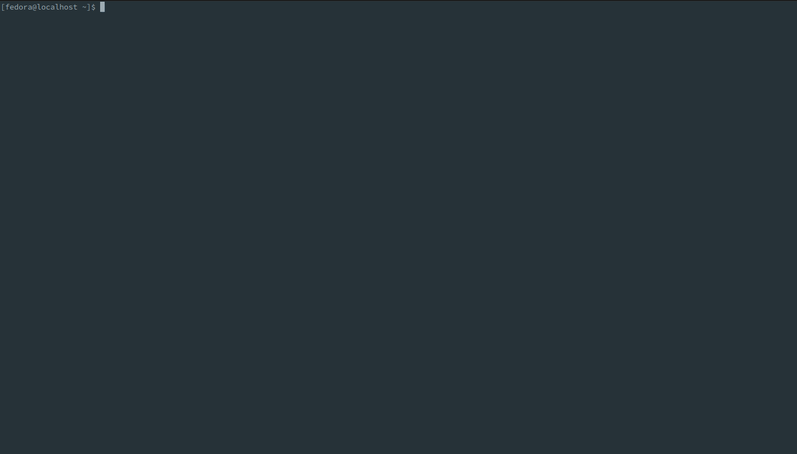

# ARA Records Ansible

ARA Records Ansible and makes it easier to understand and troubleshoot.


It's another recursive acronym and features simplicity as a core principle.

## About ara

ara provides Ansible reporting by recording ``ansible`` and ``ansible-playbook`` commands wherever and however they are run:

- from a terminal, by hand or from a script
- from a laptop, desktop, server, VM or container
- for development, CI or production
- from most Linux distributions and even on Mac OS (as long as ``python >= 3.8`` is available)
- from tools that run playbooks such as AWX & Automation Controller (Tower), ansible-(pull|test|runner|navigator) and Molecule
- from CI/CD platforms such as Jenkins, GitHub Actions, GitLab CI, Rundeck and Zuul



In addition to the built-in CLI, the data is made available through an included reporting interface as well as a REST API.


*Note: open the above gifs in a new tab (or window) if the resolution is too small*

## How it works

ara records results to SQLite, MySQL and PostgreSQL databases with a standard [Ansible callback plugin](https://docs.ansible.com/ansible/latest/plugins/callback.html).

The callback plugin leverages built-in python API clients to send data to a REST API server:


## Requirements

- Any recent Linux distribution or Mac OS with python >=3.8 available
- The ara package (containing the Ansible plugins) must be installed for the same python interpreter as Ansible itself

## Getting started

Running an API server is not required to get started and it is designed to be simple to record data to a local sqlite database.

For production use, it is strongly encouraged to:

- [Enable authentication for the web interface and API](https://ara.readthedocs.io/en/latest/api-security.html#authentication) to avoid unintentionally leaking passwords, tokens, secrets or otherwise sensitive information that ara might come across and record
- [Configure the callback plugin to ignore sensitive files, host facts and CLI arguments (such as extra vars)](https://ara.readthedocs.io/en/latest/ansible-plugins-and-use-cases.html#ansible-plugins)
- Learn about the [best practices to improve playbook recording performance](https://ara.readthedocs.io/en/latest/troubleshooting.html#improving-playbook-recording-performance)

### Recording playbooks without an API server

```bash
# Install ansible (or ansible-core) with ara (including API server dependencies)
python3 -m pip install --user ansible "ara[server]"

# Configure Ansible to use the ara callback plugin
export ANSIBLE_CALLBACK_PLUGINS="$(python3 -m ara.setup.callback_plugins)"

# Run an Ansible playbook as usual
ansible-playbook hello-world.yml

# Use the CLI to see recorded playbooks
ara playbook list

# Start the development server at http://127.0.0.1:8000
# to query the API or browse recorded results
ara-manage runserver
```

### Recording playbooks with an API server

It is possible to get started with the [ara_api role](https://github.com/ansible-community/ara-collection/blob/master/roles/ara_api/README.md)
or with the [container images](https://ara.readthedocs.io/en/latest/container-images.html) published by the project on
[DockerHub](https://hub.docker.com/r/recordsansible/ara-api) and [quay.io](https://quay.io/repository/recordsansible/ara-api):

```bash
# Create a directory for a volume to store settings and a sqlite database
mkdir -p ~/.ara/server

# Start an API server with docker from the image on DockerHub:
docker run --name api-server --detach --tty \
  --volume ~/.ara/server:/opt/ara -p 8000:8000 \
  docker.io/recordsansible/ara-api:latest

# or with podman from the image on quay.io:
podman run --name api-server --detach --tty \
  --volume ~/.ara/server:/opt/ara -p 8000:8000 \
  quay.io/recordsansible/ara-api:latest
```

Once the server is running, ara's Ansible callback plugin must be installed and configured to send data to it:

```bash
# Install ansible (or ansible-core) with ara (excluding API server dependencies)
python3 -m pip install --user ansible ara

# Configure Ansible to use the ara callback plugin
export ANSIBLE_CALLBACK_PLUGINS="$(python3 -m ara.setup.callback_plugins)"

# Set up the ara callback to know where the API server is located
export ARA_API_CLIENT="http"
export ARA_API_SERVER="http://127.0.0.1:8000"

# Run an Ansible playbook as usual
ansible-playbook playbook.yaml

# Use the CLI to see recorded playbooks
ara playbook list

# Browse http://127.0.0.1:8000 (running from the container)
# to view the reporting interface
```

Data will be available on the API server in real time as the playbook progresses and completes.

## Live demo

A live demo is deployed with the ara Ansible collection from [Ansible Galaxy](https://galaxy.ansible.com/recordsansible/ara).

It is available at https://demo.recordsansible.org.

## Documentation and changelog

Documentation for installing, configuring, running and using ara is available on [ara.readthedocs.io](https://ara.readthedocs.io).

Common issues may be resolved by reading the [troubleshooting guide](https://ara.readthedocs.io/en/latest/troubleshooting.html).

Changelog and release notes are available within the repository's [git tags](https://github.com/ansible-community/ara/tags) as well as the [documentation](https://ara.readthedocs.io/en/latest/changelog-release-notes.html).

## Community and getting help

- Bugs, issues and enhancements: https://github.com/ansible-community/ara/issues
- IRC: #ara on [Libera.chat](https://web.libera.chat/?channels=#ara)
- Matrix: Bridged from IRC via [#ara:libera.chat](https://matrix.to/#/#ara:libera.chat)
- Slack: Bridged from IRC via [https://arecordsansible.slack.com](https://join.slack.com/t/arecordsansible/shared_invite/enQtMjMxNzI4ODAxMDQxLTU2NTU3YjMwYzRlYmRkZTVjZTFiOWIxNjE5NGRhMDQ3ZTgzZmQyZTY2NzY5YmZmNDA5ZWY4YTY1Y2Y1ODBmNzc>)
- Website and blog: https://ara.recordsansible.org
- ~~Twitter: https://twitter.com/recordsansible~~
- Mastodon: https://fosstodon.org/@ara

## Contributing

Contributions to the project are welcome and appreciated !

Get started with the [contributor's documentation](https://ara.readthedocs.io/en/latest/contributing.html).

## Authors

Code contributions to the project can be viewed from the git log or on [GitHub](https://github.com/ansible-community/ara/graphs/contributors).

The ara parrot logo was designed and contributed by [Jason E. Rist](https://github.com/ansible-community/ara/commit/0d5d0939a6b7a319d99acc1fb20d4ca282bd76ab).

## Copyright

```
Copyright (c) 2022 The ARA Records Ansible authors

ARA Records Ansible is free software: you can redistribute it and/or modify
it under the terms of the GNU General Public License as published by
the Free Software Foundation, either version 3 of the License, or
(at your option) any later version.

ARA Records Ansible is distributed in the hope that it will be useful,
but WITHOUT ANY WARRANTY; without even the implied warranty of
MERCHANTABILITY or FITNESS FOR A PARTICULAR PURPOSE.  See the
GNU General Public License for more details.

You should have received a copy of the GNU General Public License
along with ARA Records Ansible.  If not, see <http://www.gnu.org/licenses/>.
```
