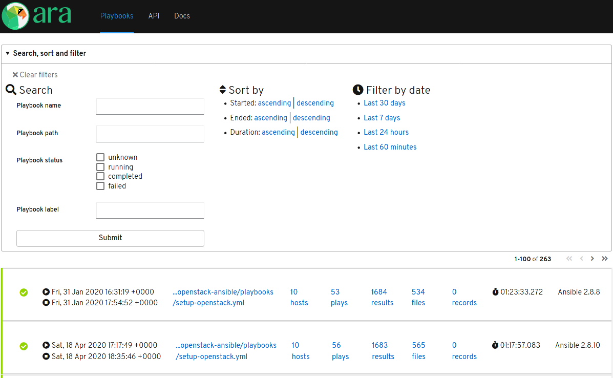

ARA Records Ansible
===================

ARA Records Ansible playbooks and makes them easier to understand and troubleshoot.

.. image:: doc/source/_static/ara-with-icon.png

How it works
============

ARA saves Ansible playbook execution results to local or remote databases by
using an Ansible `callback plugin <https://docs.ansible.com/ansible/latest/plugins/callback.html>`_.

This callback plugin leverages built-in python API clients to send data to a
REST API server where data and metrics are made available for querying,
browsing, monitoring or for integration in other tools and interfaces.

.. image:: doc/source/_static/graphs/recording-workflow.png

What it looks like
==================

API browser
-----------

Included by the API server with django-rest-framework, the API browser allows
users to navigate the different API endpoints and query recorded data.

.. image:: doc/source/_static/ui-api-browser.png

Reporting interface
-------------------

A simple reporting interface built-in to the API server without any extra
dependencies.

ara-web
-------

A project that is a work in progress and would appreciate contributions,
`ara-web <https://github.com/ansible-community/ara-web>`_ is a stateless
javascript interface to the API built with react and patternfly.

.. image:: doc/source/_static/ui-ara-web.png

Getting started
===============

Recording playbooks without an API server
-----------------------------------------

The default API client, ``offline``, requires API server dependencies to be
installed but does not need the API server to be running in order to query or
send data.

With defaults and using a local sqlite database:

.. code-block:: bash

    # Install Ansible and ARA (with API server dependencies) for the current user
    python3 -m pip install --user ansible "ara[server]"

    # Configure Ansible to use the ARA callback plugin
    export ANSIBLE_CALLBACK_PLUGINS="$(python3 -m ara.setup.callback_plugins)"

    # Run an Ansible playbook
    ansible-playbook playbook.yaml

    # Start the built-in development server to browse recorded results
    ara-manage runserver

Recording playbooks with an API server
--------------------------------------

When running Ansible from multiple servers or locations, data can be aggregated
by running the API server as a service and configuring the ARA Ansible callback
plugin to use the ``http`` API client with the API server endpoint.

The API server is a relatively simple django web application written in python
that can run with WSGI application servers such as gunicorn, uwsgi or mod_wsgi.

Alternatively, the API server can also run from a container image such as the
one available on `DockerHub <https://hub.docker.com/r/recordsansible/ara-api>`_:

.. code-block:: bash

    # Start an API server from the image on DockerHub:
    mkdir -p ~/.ara/server
    podman run --name api-server --detach --tty \
      --volume ~/.ara/server:/opt/ara:z -p 8000:8000 \
      docker.io/recordsansible/ara-api:latest

Once the server is running, Ansible playbook results can be sent to it by
configuring the ARA callback plugin:

.. code-block:: bash

    # Install Ansible and ARA (without API server dependencies) for the current user
    python3 -m pip install --user ansible ara

    # Configure Ansible to use the ARA callback plugin
    export ANSIBLE_CALLBACK_PLUGINS="$(python3 -m ara.setup.callback_plugins)"

    # Set up the ARA callback to know where the API server is located
    export ARA_API_CLIENT="http"
    export ARA_API_SERVER="http://127.0.0.1:8000"

    # Run an Ansible playbook
    ansible-playbook playbook.yaml

Data will be available on the API server in real time as the playbook progresses
and completes.

Live demo
=========

Deployments of the ARA API server and ara-web are available for demonstration
and test purposes:

- https://api.demo.recordsansible.org
- https://web.demo.recordsansible.org

These live demos are deployed using the ara_api_ and ara_web_ Ansible roles.

.. _ara_api: https://ara.readthedocs.io/en/latest/ansible-role-ara-api.html
.. _ara_web: https://ara.readthedocs.io/en/latest/ansible-role-ara-web.html

Documentation
=============

Documentation for installing, configuring, running and using ARA is
available on `readthedocs.io <https://ara.readthedocs.io>`_.

Community and getting help
==========================

- Bugs, issues and enhancements: https://github.com/ansible-community/ara/issues
- IRC: #ara on `Freenode <https://webchat.freenode.net/?channels=#ara>`_
- Slack: https://arecordsansible.slack.com (`invitation link <https://join.slack.com/t/arecordsansible/shared_invite/enQtMjMxNzI4ODAxMDQxLTU2NTU3YjMwYzRlYmRkZTVjZTFiOWIxNjE5NGRhMDQ3ZTgzZmQyZTY2NzY5YmZmNDA5ZWY4YTY1Y2Y1ODBmNzc>`_)

- Website and blog: https://ara.recordsansible.org
- Twitter: https://twitter.com/arecordsansible

Contributing
============

Contributions to the project are welcome and appreciated !

Get started with the `contributor's documentation <https://ara.readthedocs.io/en/latest/contributing.html>`_.

Authors
=======

Contributors to the project can be viewed on
`GitHub <https://github.com/ansible-community/ara/graphs/contributors>`_.

Copyright
=========

::

    Copyright (c) 2020 Red Hat, Inc.

    ARA Records Ansible is free software: you can redistribute it and/or modify
    it under the terms of the GNU General Public License as published by
    the Free Software Foundation, either version 3 of the License, or
    (at your option) any later version.

    ARA Records Ansible is distributed in the hope that it will be useful,
    but WITHOUT ANY WARRANTY; without even the implied warranty of
    MERCHANTABILITY or FITNESS FOR A PARTICULAR PURPOSE.  See the
    GNU General Public License for more details.

    You should have received a copy of the GNU General Public License
    along with ARA Records Ansible.  If not, see <http://www.gnu.org/licenses/>.
