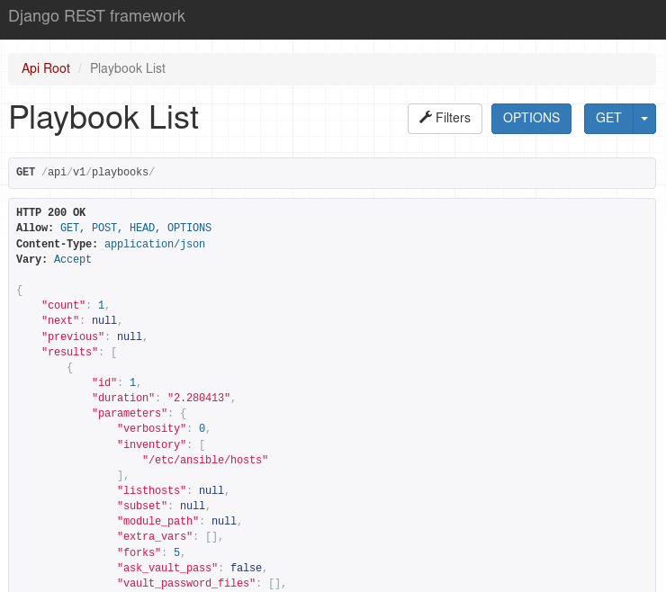

ara-server
==========

.. image:: doc/source/_static/ara-with-icon.png

ARA Records Ansible playbook runs and makes the recorded data available and
intuitive for users and systems.

ara-server is a modern python 3 application built with the latest releases of
`Django <https://www.djangoproject.com/>`_ and `django-rest-framework <https://www.django-rest-framework.org/>`_.

``ara-server`` is the component from ARA that manages the REST API and the database.

- For the ARA Ansible callback plugin or the ``ara_record`` action module, look at `ara-plugins <https://github.com/openstack/ara-plugins>`_
- For the ARA REST API clients, look at `ara-clients <https://github.com/openstack/ara-clients>`_
- For the ARA web interface, look at `ara-web <https://github.com/openstack/ara-web>`_

Quickstart
==========

Here's how you can get started from scratch with default settings::

    # Create a virtual environment
    python3 -m venv ~/.ara/venv

    # Install Ansible and the required ARA projects
    ~/.ara/venv/bin/pip install ansible ara-server ara-clients ara-plugins

    # Tell Ansible to use the ARA callback plugin from ara-plugins
    export ANSIBLE_CALLBACK_PLUGINS="$(~/.ara/venv/bin/python -m ara.plugins)/callback"

    # Run your playbook as your normally would
    ~/.ara/venv/bin/ansible-playbook playbook.yml

The data is saved in real time during the Ansible playbook execution.

What happened behind the scenes is that the ARA Ansible callback plugin
(provided by ``ara-plugins``) used the offline API client
(provided by ``ara-clients``) to send your data to the ``ara-server`` API which
then saved it to a database located by default at
``~/.ara/server/ansible.sqlite``.

You're now ready to start poking at the API with the built-in API clients !

If you'd like to have the ARA web reporting interface, take a look at
`ara-web <https://github.com/openstack/ara-web>`_.

Documentation
=============

Documentation for installing, configuring, running and using ara-server is
available on `readthedocs.io <https://ara-server.readthedocs.io>`_.

Community and getting help
==========================

You can chat with the ARA community on Slack and IRC.
The two are transparently bridged with teamchat_ which broadcasts messages from
one platform to the other.

In addition, you can also find ARA on Twitter: `@ARecordsAnsible <https://twitter.com/ARecordsAnsible>`_

**IRC**

- Server: `irc.freenode.net`_
- Channel: #ara

**Slack**

- https://arecordsansible.slack.com
- Join with the `Slack invitation <https://join.slack.com/t/arecordsansible/shared_invite/enQtMjMxNzI4ODAxMDQxLWU4MmZhZTI4ZjRjOTUwZTM2MzM3MzcwNDU1YzFmNzRlMzI0NTUzNDY1MWJlNThhM2I4ZTViZjUwZTRkNTBiM2I>`_

.. _teamchat: https://github.com/dmsimard/teamchat
.. _irc.freenode.net: https://webchat.freenode.net/

Development
===========

**TL;DR**: Using tox is convenient for the time being::

  # Retrieve the source
  git clone https://github.com/openstack/ara-server
  cd ara-server

  # Install tox from pip or from your distro packages
  pip install tox

  # Run test server -> http://127.0.0.1:8000/api/v1/
  tox -e runserver

  # Run actual tests or get coverage
  tox -e linters
  tox -e py3
  tox -e cover

  # Build docs
  tox -e docs

Authors and contributors
========================

ARA was created by David Moreau Simard (@dmsimard) and contributors can be
found on GitHub_.

.. _GitHub: https://github.com/openstack/ara-server/graphs/contributors

Copyright
=========

::

    Copyright (c) 2018 Red Hat, Inc.

    ARA is free software: you can redistribute it and/or modify
    it under the terms of the GNU General Public License as published by
    the Free Software Foundation, either version 3 of the License, or
    (at your option) any later version.

    ARA is distributed in the hope that it will be useful,
    but WITHOUT ANY WARRANTY; without even the implied warranty of
    MERCHANTABILITY or FITNESS FOR A PARTICULAR PURPOSE.  See the
    GNU General Public License for more details.

    You should have received a copy of the GNU General Public License
    along with ARA.  If not, see <http://www.gnu.org/licenses/>.