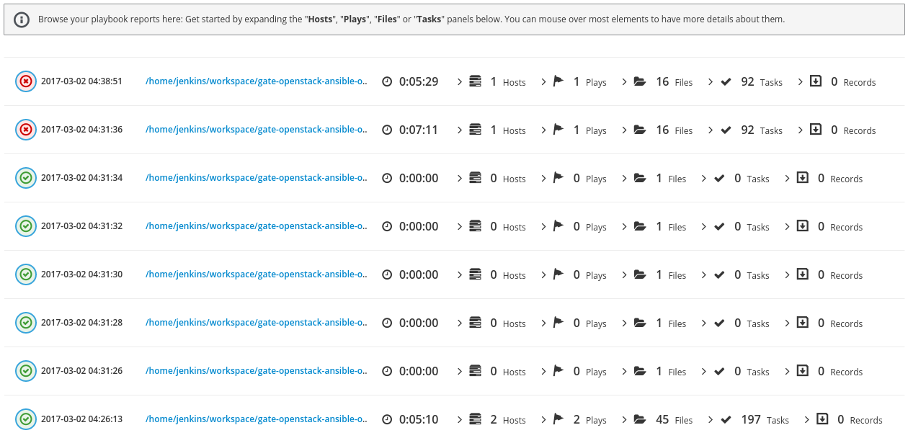

ARA: Ansible Run Analysis
=========================
.. image:: doc/source/_static/ara-with-icon.png

ARA records Ansible playbook runs and makes the recorded data available and
intuitive for users and systems.

ARA doesn't run your playbooks for you: it integrates with Ansible as a
callback plugin wherever it is.

Whether you are running Ansible from your personal laptop or a server, all
you need to do is to `install ARA`_, `configure Ansible to use ARA`_ and
you're good to go.

.. _install ARA: https://ara.readthedocs.io/en/latest/installation.html
.. _configure Ansible to use ARA: http://ara.readthedocs.io/en/latest/configuration.html

Quickstart
==========

::

    # Install ARA
    pip install ara
    # Make Ansible use the ARA callback plugin regardless of python version
    export ANSIBLE_CALLBACK_PLUGINS="$(python -c 'import os,ara; print(os.path.dirname(ara.__file__))')/plugins/callbacks"
    # Run your playbook
    # ansible-playbook myplaybook.yml
    # Start the ARA standalone webserver
    ara-manage runserver
    # Browse http://127.0.0.1:9191

Refer to the documentation_ for more information.

.. _documentation: https://ara.readthedocs.io/en/latest/

ARA components
==============

ARA has four main components:

1. An `Ansible callback plugin`_ to record playbook runs into a local or remote database
2. The ara_record_ and ara_read_ pair of Ansible modules to record and read persistent data with ARA
3. A `CLI client`_ to query the database
4. A `dynamic, database-driven web interface`_ that can also be `generated and served from static files`_

.. _ARA: https://github.com/openstack/ara
.. _Ansible: https://www.ansible.com/
.. _Ansible callback plugin: https://ara.readthedocs.io/en/latest/configuration.html#ansible
.. _ara_record: http://ara.readthedocs.io/en/latest/usage.html#using-the-ara-record-module
.. _ara_read: http://ara.readthedocs.io/en/latest/usage.html#using-the-ara-read-module
.. _CLI client: https://ara.readthedocs.io/en/latest/usage.html#querying-the-database-with-the-cli
.. _dynamic, database-driven web interface: https://ara.readthedocs.io/en/latest/faq.html#what-does-the-web-interface-look-like
.. _generated and served from static files: https://ara.readthedocs.io/en/latest/usage.html#generating-a-static-html-version-of-the-web-application

What does the web interface look like ?
---------------------------------------

A video preview and explanation of the web interface is available on
YouTube_, featuring playbook runs from the OpenStack-Ansible_ project.

Otherwise, screenshots highlighting some of ARA's features are available in
`the frequently asked questions`_

.. _YouTube: https://www.youtube.com/watch?v=k3i8VPCanGo
.. _OpenStack-Ansible: https://github.com/openstack/openstack-ansible
.. _the frequently asked questions: https://ara.readthedocs.io/en/latest/faq.html#interface-preview

Community and getting help
==========================

The ARA community hangs out on IRC, Slack and Discord.

All three chats are seamlessly linked to each other so you can use your
preferred client to come chat with us !

**IRC**

- Server: `irc.freenode.net`_
- Channel: #ara

**Slack**

- https://ara-community.slack.com
- Join with the `Slack invitation <https://join.slack.com/t/ara-community/shared_invite/MjMxNzI4ODAxMDQxLTE1MDM4MDEzMTEtNzU1NTUwMTcyOQ>`_

**Discord**

- https://discordapp.com
- Join with the `Discord invitation <https://discord.gg/z2SGdc9>`_

.. _irc.freenode.net: https://webchat.freenode.net/

Contributing, testing, issues and bugs
======================================

Contributions to ARA are definitely welcome and much appreciated !

ARA does not use GitHub for issues or pull requests.

ARA uses the OpenStack infrastructure for code hosting and review as well as
project and bug/issue tracking.

The `contributor documentation`_ will get you started quickly if you need help
contributing !

* Submitted code reviews are available on **Gerrit**:
  https://review.openstack.org/#/q/project:openstack/ara
* Bugs, issues and feature tracking are available on **StoryBoard**:
  https://storyboard.openstack.org/#!/project/843

Each commit to ARA is reviewed and also rigorously tested to prevent
regressions. Here's our current testing coverage:

+------------------+--------+--------+----------+--------+--------+
| -                | Fedora | CentOS | OpenSUSE | Debian | Ubuntu |
+==================+========+========+==========+========+========+
| Ansible 2.2.3.0  |        |        |          |    X   |        |
+------------------+--------+--------+----------+--------+--------+
| Ansible 2.3.2.0  |        |    X   |          |        |        |
+------------------+--------+--------+----------+--------+--------+
| Ansible "latest" |    X   |        |     X    |        |    X   |
+------------------+--------+--------+----------+--------+--------+
| Ansible "devel"  |    X   |        |          |        |    X   |
+------------------+--------+--------+----------+--------+--------+

You might also be interested in reading the project manifesto_ in order to have
a good understanding of the project's core values and philosophy.

.. _contributor documentation: https://ara.readthedocs.io/en/latest/contributing.html
.. _manifesto: https://ara.readthedocs.io/en/latest/manifesto.html

Documentation
=============

`Frequently asked questions`_ and documentation on how to install_, configure_,
use_ to ARA is available on `readthedocs.io`_.

.. _Frequently asked questions: https://ara.readthedocs.io/en/latest/faq.html
.. _install: https://ara.readthedocs.io/en/latest/installation.html
.. _configure: https://ara.readthedocs.io/en/latest/configuration.html
.. _use: https://ara.readthedocs.io/en/latest/usage.html

.. _readthedocs.io: https://ara.readthedocs.io/en/latest/

Contributors
============

See contributors on GitHub_.

.. _GitHub: https://github.com/openstack/ara/graphs/contributors

Copyright
=========

::

    Copyright (c) 2017 Red Hat, Inc.

    ARA is free software: you can redistribute it and/or modify
    it under the terms of the GNU General Public License as published by
    the Free Software Foundation, either version 3 of the License, or
    (at your option) any later version.

    ARA is distributed in the hope that it will be useful,
    but WITHOUT ANY WARRANTY; without even the implied warranty of
    MERCHANTABILITY or FITNESS FOR A PARTICULAR PURPOSE.  See the
    GNU General Public License for more details.

    You should have received a copy of the GNU General Public License
    along with ARA.  If not, see <http://www.gnu.org/licenses/>.
