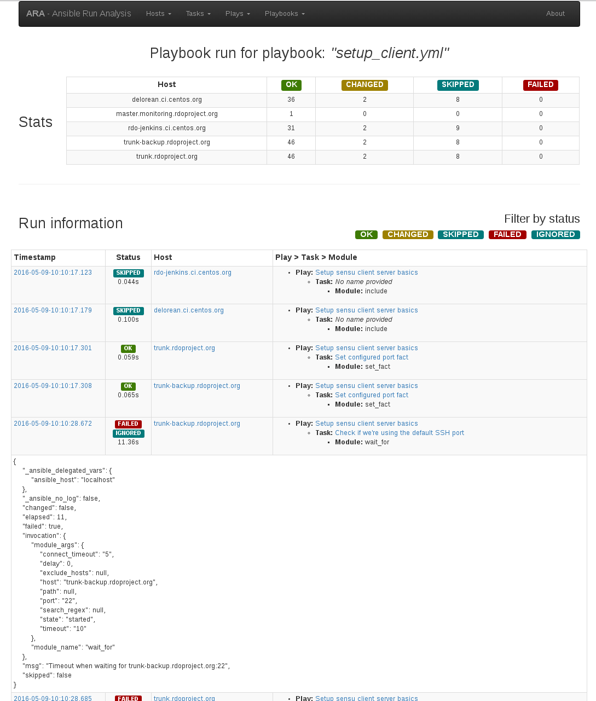

ARA: Ansible Run Analysis
=========================
Important note
--------------
ARA is in very early development !
The documentation is definitely not thorough.

Please feel free to ask questions, provide feedback, comments, bugs, ideas,
suggestions or contributions !

tl;dr
-----
ARA_ is an attempt to make Ansible_ runs easier to visualize, understand and
troubleshoot.

It provides an Ansible callback to record playbook run data in a database and
a web interface built with Flask_ to browse that data.

.. _ARA: https://github.com/dmsimard/ara
.. _Ansible: https://www.ansible.com/
.. _Flask: http://flask.pocoo.org/

What it looks like
------------------

Documentation
-------------
There is (limited) documentation available on `readthedocs.io`_.

.. _readthedocs.io: http://ara.readthedocs.io/en/latest/

Installing and Using ARA
------------------------
See the documentation_.

.. _documentation: http://ara.readthedocs.io/en/latest/installing.html

Author
======
David Moreau Simard

Contributors and special thanks
===============================
See contributors on GitHub_.

Special thanks to those who provided early feedback on the project.

.. _GitHub: https://github.com/dmsimard/ara/graphs/contributors

Copyright
=========
Copyright 2016 Red Hat, Inc.

Licensed under the Apache License, Version 2.0 (the "License");
you may not use this file except in compliance with the License.
You may obtain a copy of the License at

    http://www.apache.org/licenses/LICENSE-2.0

Unless required by applicable law or agreed to in writing, software
distributed under the License is distributed on an "AS IS" BASIS,
WITHOUT WARRANTIES OR CONDITIONS OF ANY KIND, either express or implied.
See the License for the specific language governing permissions and
limitations under the License.
