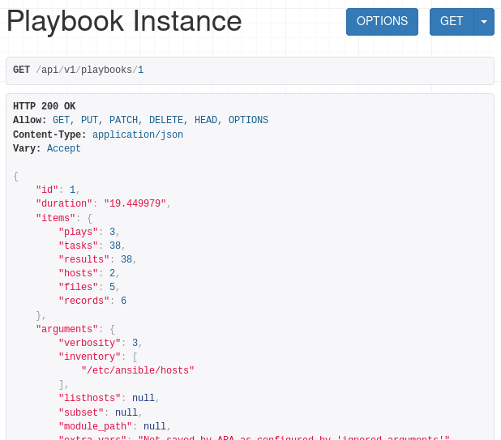

API Documentation
=================

The API documentation is a work in progress.

Built-in API browser interface
------------------------------

ARA ships with a helpful interface to navigate the API directly from your
favorite web browser.

For example, if you run ``ara-manage runserver``, this interface would be
available at ``http://127.0.0.1:8000/api/v1/``:

.. image:: ../source/_static/ara-api-browser-root.png

You can navigate the interface and drill down to list views, for example:

.. image:: ../source/_static/ara-api-browser-playbooks.png

You can also see what a detailed view looks like by querying a specific object id:

Alternatively, you may also find an up-to-date live demonstration of the API at
``https://api.demo.recordsansible.org``.

Relationship between objects
----------------------------

The relationship between objects in the API should be straightforward with an
understanding of how Ansible playbooks are executed.

Generally speaking, the data is organized in the following fashion::

   labels
     |
  Playbook -> Play -> Task -> Result <- Host
     |                  |       |        |
    file               file   content   facts

- Every object is associated to a playbook (except *labels* which are applied to playbooks)
- In a playbook you have plays
- In plays you have tasks
- In tasks you have results
- Results have a relationship to their parent task and the host the task ran on

- Files are only associated to a playbook but tasks have a reference to the file
  they were executed from
- Records (provided by ``ara_record``) are only associated to a playbook

Additional fields may only be available in the detailed views. For example:

- Playbooks arguments with ``/api/v1/playbooks/<id>``
- Hosts facts with ``/api/v1/hosts/<id>``
- Results content with ``/api/v1/results/<id>``
- Files content with ``/api/v1/files/<id>``

ARA ships with two built-in API clients to help you get started. You can learn
more about those clients in :ref:`api-usage:Using ARA API clients`.
