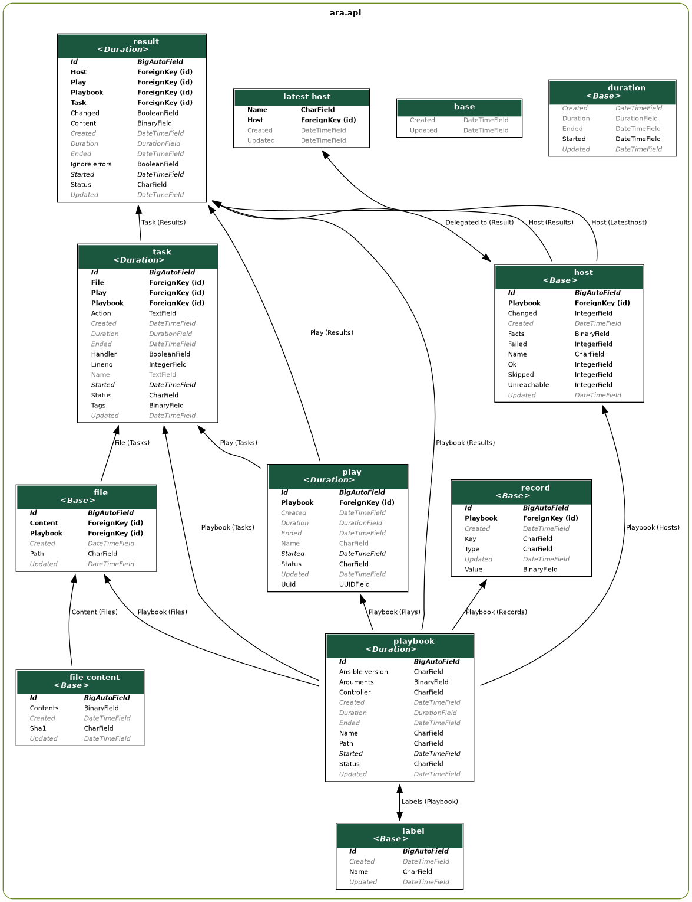

API Documentation
=================

The API documentation is a work in progress.

Built-in API browser interface
------------------------------

ARA ships with a helpful interface to navigate the API directly from your
favorite web browser.

For example, if you run ``ara-manage runserver``, this interface would be
available at ``http://127.0.0.1:8000/api/v1/``:

.. image:: ../source/_static/ui-api-browser.png

You can navigate the interface and drill down to list views, for example:

.. image:: ../source/_static/ui-api-browser-playbooks.png

You can also see what a detailed view looks like by querying a specific object id:

.. image:: ../source/_static/ui-api-browser-playbook.png

Alternatively, you may also find an up-to-date live demonstration of the API at
``https://demo.recordsansible.org``.

Relationship between objects
----------------------------

Here's a high level overview of how data is generally organized::

    Label   Record (ara_record)              LatestHost
        \   /                                 /
      Playbook -> Play -> Task -> Result <- Host
              \          /          |        |
               \        /        Content   Facts
                \ File /
                   |
                Content

- Every object except labels and LatestHost are associated to a parent playbook
- Labels are applied on a playbook while a LatestHost references a specific Host
- Records have a key, a value and a type provided by :ref:`ara_record <ara_record>`
- In a playbook there are plays
- In a play there are tasks
- In a task there are results
- Results have a relation to their parent task and the host the task ran on
- Results have content with data returned by Ansible for a task on a host
- Hosts have stats provided by Ansible and facts (if they have been set or gathered)
- A LatestHost relation keeps track of the last playbook a host name was involved in
- Playbooks and Tasks both have a path and a reference to a File
- A file has content compressed and uniquely stored, hashed by sha1

These relationships are also represented in the database model:

.. tip::
    Open the image above in a new tab to see it in full resolution.

Additional fields may only be available in the detailed views. For example:

- Playbooks arguments with ``/api/v1/playbooks/<id>``
- Hosts facts with ``/api/v1/hosts/<id>`` or ``/api/v1/latesthosts``
- Results content with ``/api/v1/results/<id>``
- Files content with ``/api/v1/files/<id>``

ARA ships with two built-in API clients to help you get started. You can learn
more about those clients in :ref:`api-usage:Using ARA API clients`.
