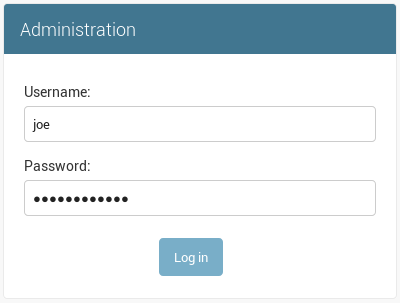
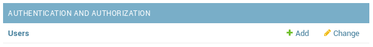
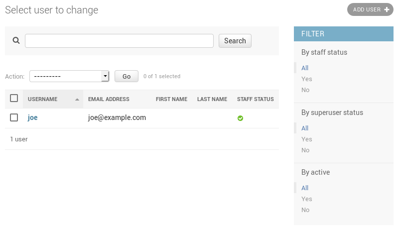

.. _security:

ARA API Server authentication and security
==========================================

The API server ships with a default configuration that emphasizes simplicity to
let users get started quickly.

By default:

- A random SECRET_KEY will be generated once if none are supplied
- No users are created
- API authentication and permissions are not enabled
- ALLOWED_HOSTS and CORS_ORIGIN_WHITELIST are configured for use on localhost

These default settings can be configured according to the requirements of your
deployments.

.. note::
   For production use and to avoid unintentionally leaking passwords, tokens, secrets or
   otherwise sensitive information that ara might come across and record, it is strongly encouraged to:

   1) :ref:`Enable authentication for the web interface and API <authentication>` (see below)
   2) :ref:`Configure the callback plugin to ignore sensitive files, host facts and CLI arguments (such as extra vars) <ansible_plugins>`

Setting a custom secret key
---------------------------

By default, the API server randomly generates a token for the
:ref:`api-configuration:ARA_SECRET_KEY` setting if none have
been supplied by the user.

This value is persisted in the server configuration file in order to prevent
the key from changing on every instanciation of the server.

The default location for the server configuration file is
``~/.ara/server/settings.yaml``.

You can provide a custom secret key by supplying the ``ARA_SECRET_KEY``
environment variable or by specifying the ``SECRET_KEY`` setting in your server
configuration file.

.. _authentication:

Authentication and user management
----------------------------------

It is recommended to set up authentication to protect the ara API and reporting
interface since the data collected by ara can be sensitive or otherwise
non-public information about your hosts, playbook files or task results.

There are two main ways of managing authentication:

1) Via a server/proxy in front of the API server (recommended, best performance)
2) Via django's built-in authentication (impacts performance but doesn't require server/proxy in front)

In the first scenario, there could be an nginx reverse proxy or apache2/httpd
server with mod_proxy authenticating against a .htpasswd file, ldap and other
authentication mechanisms supported by the servers.

Once authenticated, users and clients have read/write access unless there is a
specific proxy configuration based on the URL or methods (GET/POST/PATCH/DELETE).

In the second case, there can still be a server/proxy in front but it wouldn't
manage the authentication. Users are managed in django and authentication is done
against the database backend for each request, incurring a performance hit when
validating access and permissions.

This method provides the possibility of a simple "read-only" access by setting
``READ_LOGIN_REQUIRED: false`` and ``WRITE_LOGIN_REQUIRED: true``.

#1: Authentication via a server/proxy
~~~~~~~~~~~~~~~~~~~~~~~~~~~~~~~~~~~~~

When authentication is handled by a server or proxy in front of the ara API
server, the following should be set in ``~/.ara/server/settings.yaml``::

    default:
      # [...]
      EXTERNAL_AUTH: true
      READ_LOGIN_REQUIRED: false
      WRITE_LOGIN_REQUIRED: false
      # [...]

:ref:`EXTERNAL_AUTH <api-configuration:ARA_EXTERNAL_AUTH>` is used to accept
authentication provided by the server in front of the API server.

:ref:`READ_LOGIN_REQUIRED <api-configuration:ARA_READ_LOGIN_REQUIRED>`
and :ref:`WRITE_LOGIN_REQUIRED <api-configuration:ARA_WRITE_LOGIN_REQUIRED>`
should both be false as they are only used when django is the one handling the
authentication.

Once the ara API server has been restarted with the right settings, it is ready
to accept requests from a server or proxy in front of it.

What follows are some example proxy configurations that have been contributed
by users.

.htpasswd with nginx or apache2/httpd
*************************************

1) Set up the right configuration in settings.yaml (see parent)
2) Install and start nginx or apache2/httpd
3) Create a .htpasswd file with an encrypted username/password, for example:
   ``htpasswd -c -m /etc/httpd/.htpasswd username``
4) Set up a virtual host configuration in nginx or apache2/httpd
5) Ensure ara and proxy servers have been restarted with new configuration
6) Complete

For apache2/httpd, you can get started with the following configuration::

    # /etc/httpd/conf.d/ara.conf
    # or /etc/apache2/sites-{available|enabled}/ara.conf
    <VirtualHost *:80>
        ServerName ara.example.org
        ProxyPass / http://127.0.0.1:8000/
        ProxyPassReverse / http://127.0.0.1:8000/

        <Location />
            Deny from all
            AuthUserFile /etc/httpd/.htpasswd
            AuthName "Privileged access"
            AuthType Basic
            Satisfy Any
            require valid-user
        </Location>
    </VirtualHost>

For nginx, you can get started with the following configuration::

    # /etc/nginx/conf.d/ara.conf
    # or /etc/nginx/sites-{available|enabled}/ara.conf
    upstream ara_api {
        # fail_timeout=0 means we always retry an upstream even if it failed
        # to return a good HTTP response
        server 127.0.0.1:8000 fail_timeout=0;
    }

    server {
        listen 80 default_server;
        server_name ara.example.org;
        auth_basic "Privileged access";
        auth_basic_user_file /etc/nginx/.htpasswd;

        # Everything, including static files, is served by the backend
        location ~ {
            # checks if the file exists, if not found proxy to app
            try_files $uri @proxy_to_app;
        }

        location @proxy_to_app {
            proxy_set_header X-Forwarded-For $proxy_add_x_forwarded_for;
            proxy_set_header X-Forwarded-Proto $scheme;
            proxy_set_header Host $http_host;

            proxy_redirect off;
            proxy_pass http://ara_api;
        }
    }

ldap with apache2/httpd and mod_ldap
************************************

1) Set up the right configuration in settings.yaml (see parent)
2) Install and start apache2/httpd with mod_ldap
3) Set up a virtual host configuration for apache2/httpd
4) Ensure ara and proxy servers have been restarted with new configuration
5) Complete

You can get started with the following configuration::

    # /etc/httpd/conf.d/ara.conf
    # or /etc/apache2/sites-{available|enabled}/ara.conf
    <VirtualHost *:80>
        ServerName ara.example.org
        ProxyPass / http://127.0.0.1:8000/
        ProxyPassReverse / http://127.0.0.1:8000/

        <Location />
            AuthName "Privileged access"
            AuthType Basic
            AuthBasicProvider ldap
            AuthLDAPURL "ldap://openldap/dc=example,dc=org?uid"
            AuthLDAPBindDN "cn=admin,dc=example,dc=org"
            AuthLDAPBindPassword "some_password"
            Require valid-user
            Allow from all
            Order allow,deny
        </Location>
    </VirtualHost>

#2: Authentication via django
~~~~~~~~~~~~~~~~~~~~~~~~~~~~~

The API server can leverage Django's built-in `user management <https://docs.djangoproject.com/en/2.2/topics/auth/default/>`_
but doesn't create any user by default.

.. note::
    Creating users does not enable authentication on the API.
    In order to make authentication required for using the API, see `Enabling authentication for read or write access`_.

In order to create users, you'll need to create a superuser account before
running the API server::

    $ ara-manage createsuperuser --username=joe --email=joe@example.com
    Password:
    Password (again):
    Superuser created successfully.

.. tip::
    If you ever need to reset the password of a superuser account, this can be
    done with the "changepassword" command::

        $ ara-manage changepassword joe
        Changing password for user 'joe'
        Password:
        Password (again):
        Password changed successfully for user 'joe'

Once the superuser has been created, make sure the API server is started and
then login to the Django web administrative interface using the credentials
you just set up.

By default, you can start the API server with ``ara-manage runserver`` and
access the admin interface at ``http://127.0.0.1:8000/admin/``.

Log in to the admin interface:

Access the authentication and authorization configuration:

And from here, you can manage existing users or create new ones:

Enabling authentication for read or write access
************************************************

Once django users have been created, you can enable authentication against the API
for read (ex: GET) and write (ex: DELETE, POST, PATCH) requests.

This is done with the two following configuration options:

- :ref:`api-configuration:ARA_READ_LOGIN_REQUIRED` for read access
- :ref:`api-configuration:ARA_WRITE_LOGIN_REQUIRED` for write access

These settings are global and are effective for all API endpoints.

Setting up authentication for the Ansible plugins
-------------------------------------------------

The callback plugin used to record playbooks as well as the ``ara_record``
action plugin will need to authenticate against the API if authentication is
enabled and required.

You can specify the necessary credentials through the ``ARA_API_USERNAME`` and
``ARA_API_PASSWORD`` environment variables or through your ``ansible.cfg`` file:

.. code-block:: ini

    [defaults]
    # ...

    [ara]
    api_client = http
    api_server = http://api.example.org
    api_username = ara
    api_password = password

Using authentication with the API clients
-----------------------------------------

To instanciate an authenticated client with the built-in basic HTTP
authentication provided by Django:

.. code-block:: python

    from ara.clients.utils import get_client
    client = get_client(
        client="http",
        endpoint="http://api.example.org",
        username="ara",
        password="password"
    )

If you have a custom authentication that is supported by the
`python requests <https://2.python-requests.org/en/master/user/authentication/>`_
library, you can also pass the relevant ``auth`` object directly to the client:

.. code-block:: python

    from ara.clients.http import AraHttpClient
    from requests_oauthlib import OAuth1
    auth = OAuth1(
        "YOUR_APP_KEY",
        "YOUR_APP_SECRET",
        "USER_OAUTH_TOKEN",
        "USER_OAUTH_TOKEN_SECRET"
    )
    client = AraHttpClient(endpoint="http://api.example.org", auth=auth)

Managing hosts allowed to serve the API
---------------------------------------

By default, :ref:`api-configuration:ARA_ALLOWED_HOSTS` authorizes
``localhost``, ``::1`` and ``127.0.0.1`` to serve requests for the API server.

In order to host an instance of the API server on another domain, the domain must
be part of this list or the application server will deny any requests sent to
it.

Managing CORS (cross-origin resource sharing)
---------------------------------------------

The :ref:`api-configuration:ARA_CORS_ORIGIN_WHITELIST` default is designed to
allow a local development instance of an `ara-web <https://github.com/ansible-community/ara-web>`_
dashboard to communicate with a local development instance of the API server.

The whitelist must contain the domain names where you plan on hosting instances
of ara-web.
