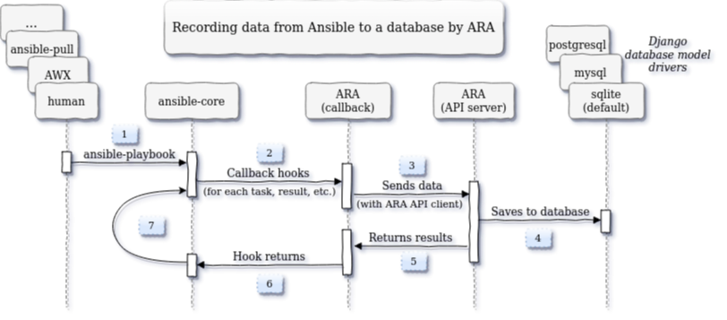

Architecture and Workflows
==========================

Recording data from Ansible
---------------------------

ARA Records Ansible playbooks through an Ansible `callback plugin`_.

0. ARA is installed and Ansible is configured to use the callback plugin
1. An ``ansible-playbook`` command is executed
2. Ansible triggers the callback plugin for every event (``v2_playbook_on_start``, ``v2_runner_on_failed``, etc.)
3. The relevant information is retrieved from the Ansible playbook execution context and is sent to the API server
4. The API server validates and serializes the data before storing it the configured database backend
5. The API server sends a response back to the API client with the results
6. The callback plugin returns, ending the callback hook
7. Ansible continues running the playbook until it fails or is completed (back to step 2)

.. _callback plugin: https://docs.ansible.com/ansible/latest/plugins/callback.html
