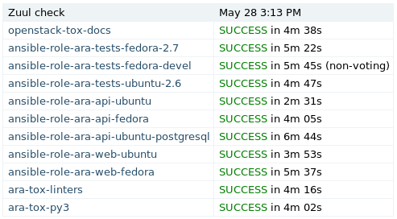

How to contribute
=================

ARA Records Ansible is an open source community project and welcomes
contributions, whether they are in the form of feedback, comments, suggestions,
bugs, documentation, code, or code reviews.

The ARA code review and CI infrastructure is hosted by `opendev.org <https://opendev.org>`_
which provides Gerrit for code review, Zuul for CI/CD as well as many other
systems.

All new patches are automatically tested with lint, unit and a variety of
integration test scenarios.
The end result is higher standards, better code, more testing, less regressions
and more stability.

Running tests locally
---------------------

- Unit tests: ``tox -e py37``
- Linters tests (pep8/flake8/bandit/bashate/black/isort/etc): ``tox -e linters``
- Documentation tests (builds to ``docs/build/html``): ``tox -e docs``
- Integration tests: ``tox -e ansible-integration``

Issues and pull requests
------------------------

ARA has several projects that are mirrored to GitHub:

- https://opendev.org/recordsansible/ara -> https://github.com/ansible-community/ara
- https://opendev.org/recordsansible/ara-web -> https://github.com/ansible-community/ara-web
- https://opendev.org/recordsansible/ara-infra -> https://github.com/ansible-community/ara-infra

While new issues, bugs and feature requests should be filed on GitHub, we are
unable to accept pull requests on GitHub at this time.

We would appreciate the opportunity to accept them in the future by trying
`Gerritbot <https://github.com/ansible-community/ara-infra/issues/4>`_ to
synchronize pull requests to Gerrit.

In the meantime, what follows are the required steps in order to send a patch
to Gerrit.

Set up your Ubuntu Launchpad account
------------------------------------

OpenDev's Gerrit_ instance currently uses Launchpad_ for authentication.
If you do not already have a Launchpad account, you will need to create one
here_.

.. _here: https://login.launchpad.net/+login

Set up your Gerrit code review account
--------------------------------------

If you'll be contributing code or code reviews, you'll need to set up your
Gerrit code review account.

Once you have your Launchpad account, you will be able to sign in to
`review.opendev.org`_.

To be able to submit code, Gerrit needs to have your public SSH key in the
same way Github does. To do that, click on your name at the top right and go
to the settings where you will see the tab to set up your SSH key.

Note that if the username from your local machine differs from the one in Gerrit,
you might need to set it up in your local ``~/.ssh/config`` file like this::

  Host review.opendev.org
    user foo
    identityfile /home/foo/.ssh/gerrit

.. _Launchpad: https://login.launchpad.net/+login
.. _review.opendev.org: https://review.opendev.org/

Installing Git Review
---------------------

Git Review is a python module that adds a "git review" command that wraps
around the process of sending a commit for review in Gerrit. You need to
install it to be able to send patches for code reviews.

There are different ways to install git-review, `choose your favorite`_.

.. _choose your favorite: https://docs.openstack.org/infra/manual/developers.html#install-the-git-review-utility

Sending a patch for review
--------------------------

The process looks a bit like this:

.. code-block:: bash

    $ git clone https://opendev.org/recordsansible/ara
    # or git clone https://github.com/ansible-community/ara
    $ cd ara
    # Create a new local branch
    $ git checkout -b super_cool_feature
    # hack on super_cool_feature
    $ git commit -a --message="This is my super cool feature"
    $ git review

When you send a commit for review, it'll create a code review request in
Gerrit_ for you.
When that review is created, it will automatically be tested by a variety of
jobs that the ARA maintainers have set up to test every patch that is sent.

We'll check for things like code quality (pep8/flake8), run unit tests to catch
regressions and we'll also run both integration tests on different operating
systems to make sure everything really works.

The result of the tests are added as a comment in the review when all of them
are completed. If you're interested in digging into the logs for a particular
test, clicking on the results of the test will take you to console, debug
logs and a built version of ARA's web interface.

If you get a failed test result and you believe you have fixed the issue, add
the files, amend your commit (``git commit --amend``) and send it for review
once again. This will create a new patchset that will be up for review and
testing.

To be able to merge a patch, the tests have to come back successful and the
core reviewers must provide their agreement with the patch.

.. _Gerrit: https://review.opendev.org
