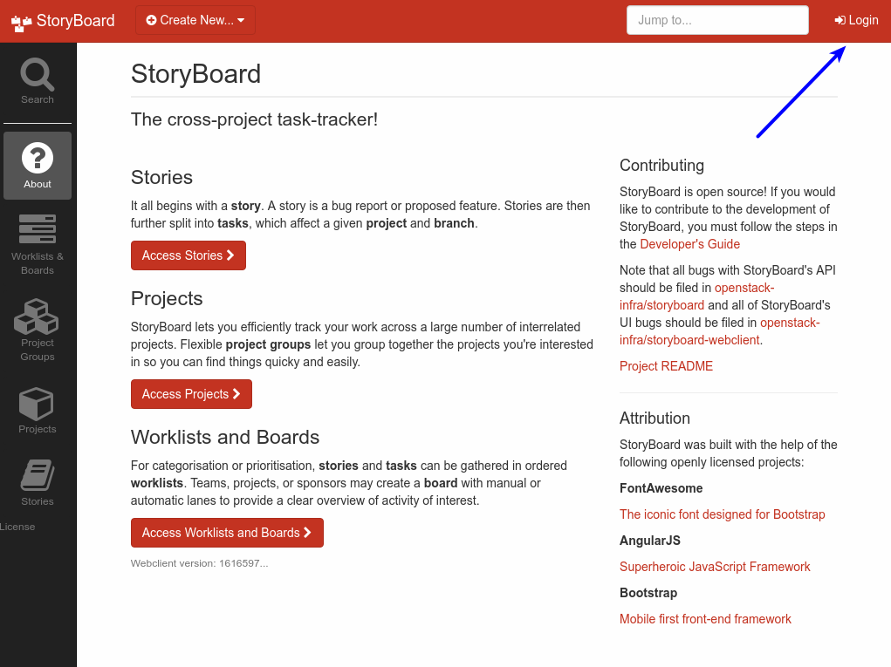
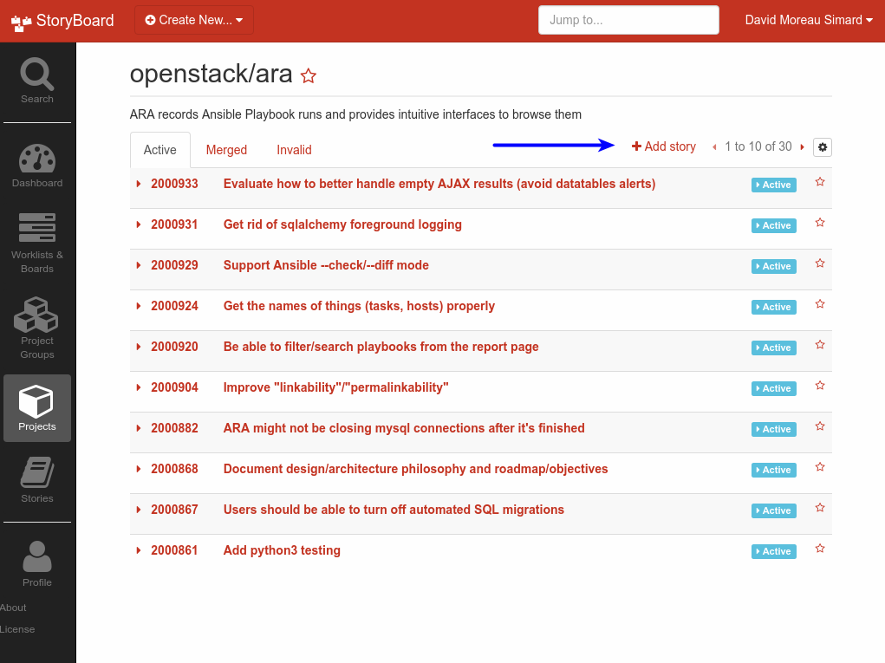
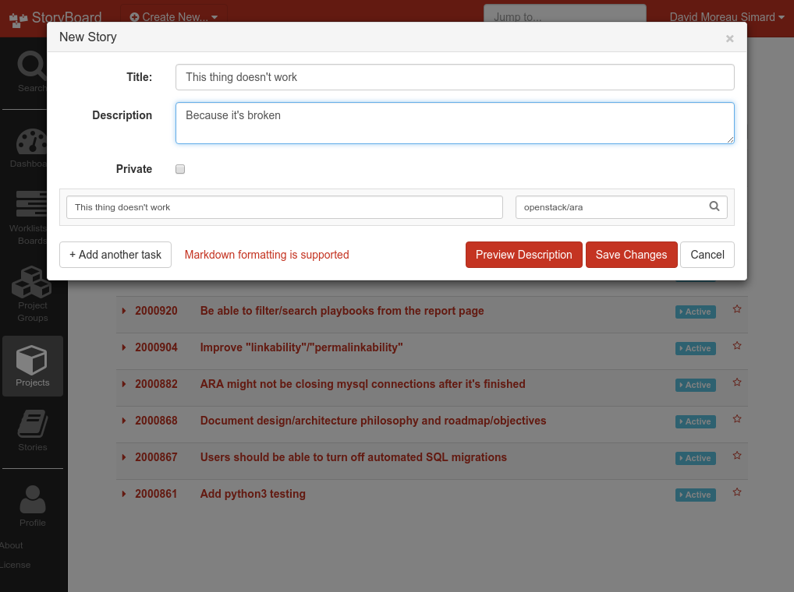
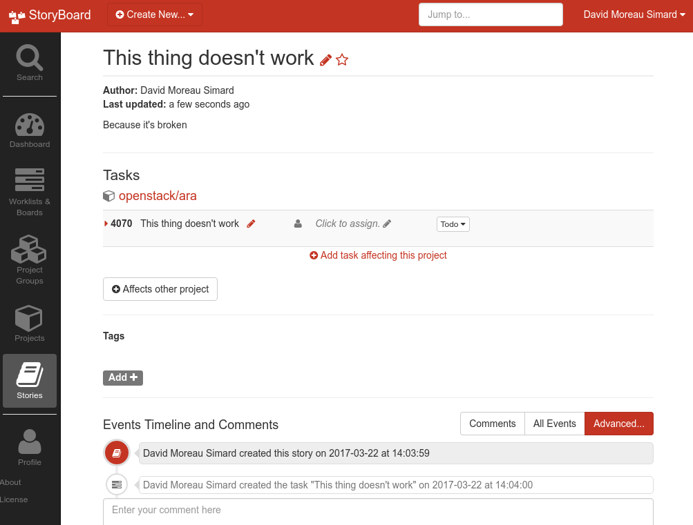
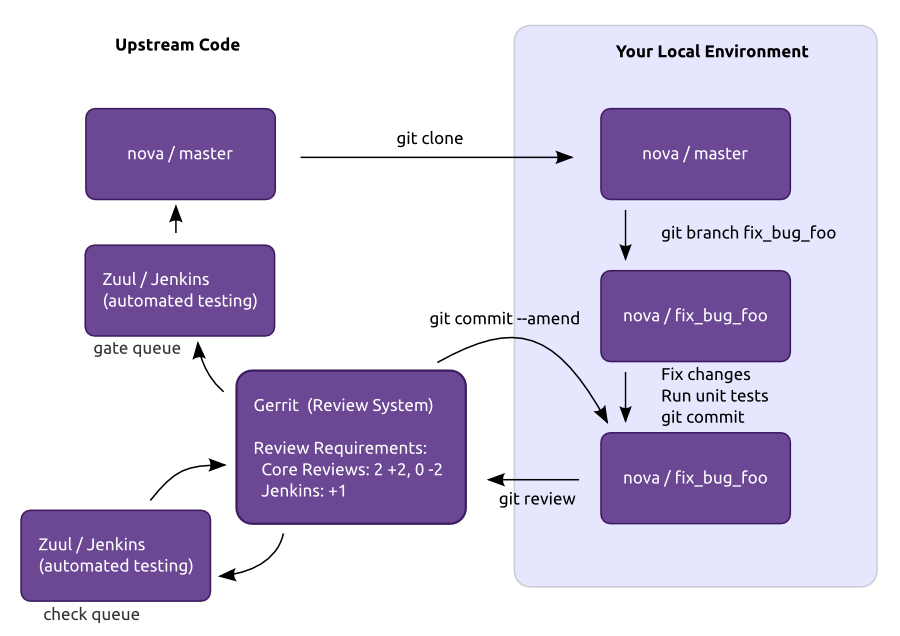

Contributing
============

ARA is an Open Source project and welcomes contributions, whether they are in
the form of feedback, comments, suggestions, bugs, code contributions or
code reviews.

ARA does not use GitHub for issues or pull requests.

The project has decided to be hosted under the OpenStack_ umbrella to benefit
from the code review and testing infrastructure on which hundreds of
developers contribute to hundreds of projects every day.

This proven infrastructure brings with it a robust contribution workflow to
be able to contribute, review, test and merge code easily and efficiently.

The end result is higher standards, better code, more testing, less regressions
and more stability.

If you are familiar with the process of contributing to an OpenStack project,
ARA is no different. If this is something new for you, you should be excited
and read on.

This documentation you will find here is mostly a summary of
`OpenStack's developer getting started`_ guide.

.. note::

   ARA is *not* an official OpenStack project. As such, you are not
   required to have signed a contributors agreement with the OpenStack
   foundation to be able to contribute to ARA.

.. _OpenStack: http://www.openstack.org/
.. _OpenStack's developer getting started: https://docs.openstack.org/infra/manual/developers.html

Set up your Ubuntu Launchpad account
------------------------------------

OpenStack's Gerrit_ and StoryBoard_ instances currently use Launchpad_ for
authentication. If you do not already have a Launchpad account,
you will need to create one here_.

.. _StoryBoard: https://storyboard.openstack.org/#!/page/about
.. _here: https://login.launchpad.net/+login

Filing issues and bugs
----------------------

Once you have your Ubuntu Launchpad account set up, you're ready to start
contributing to the ARA project tracker in StoryBoard_.

First, you'll need to login to StoryBoard -- the ARA project can be found here:
https://storyboard.openstack.org/#!/project/843

.. image:: _static/storyboard-launchpad.png

Once you're logged in, you'll want to create a story for the
``openstack/ara`` project:

And then you're done:

Contributing code or code reviews
---------------------------------

Set up your Gerrit code review account
~~~~~~~~~~~~~~~~~~~~~~~~~~~~~~~~~~~~~~

If you'll be contributing code or code reviews, you'll need to set up your
Gerrit code review account.

Once you have your Launchpad account, you will be able to sign in to
`review.openstack.org`_.

To be able to submit code, Gerrit needs to have your public SSH key in the
same way Github does. To do that, click on your name at the top right and go
to the settings where you will see the tab to set up your SSH key.

.. _Launchpad: https://login.launchpad.net/+login
.. _review.openstack.org: https://review.openstack.org/

Installing Git Review
~~~~~~~~~~~~~~~~~~~~~

Git Review is a python module that adds a "git review" command that wraps
around the process of sending a commit for review in Gerrit. You need to
install it to be able to send patches for code reviews.

There are different ways to install git-review, `choose your favorite`_.

.. _choose your favorite: https://docs.openstack.org/infra/manual/developers.html#installing-git-review

Install development dependencies
~~~~~~~~~~~~~~~~~~~~~~~~~~~~~~~~

ARA requires some additional dependencies for development purposes, for running
tests, for example.

Make sure they are installed according to the :ref:`documentation <installation>`.

Sending a patch for review
--------------------------

The process looks a bit like this::

    $ git clone https://github.com/openstack/ara
    $ cd ara
    $ git checkout -b super_cool_feature

    # << hack on super_cool_feature >>

    $ git commit -a --message="This is my super cool feature"
    $ git review

When you send a commit for review, it'll create a code review request in
Gerrit_ for you.
When that review is created, it will automatically be tested by a variety of
jobs that the ARA maintainers have set up to test every patch that is sent.

We'll check for things like code quality (pep8/flake8), run unit tests to catch
regressions and we'll also run both integration tests on different operating
systems to make sure everything really works.

The result of the tests are added as a comment in the review when all of them
are completed. If you're interested in digging into the logs for a particular
test, clicking on the results of the test will take you to console, debug
logs and a built version of ARA's web interface.

If you get a failed test result and you believe you have fixed the issue, add
the files, amend your commit (``git commit --amend``) and send it for review
once again. This will create a new patchset that will be up for review and
testing.

To be able to merge a patch, the tests have to come back successful and the
core reviewers must provide their agreement with the patch.

.. _Gerrit: https://review.openstack.org

Running tests locally
---------------------

Unit tests::

   # Python 2.7
   tox -e py27
   # Python 3.5
   tox -e py35

pep8/flake8/bandit tests::

   tox -e pep8

Documentation tests::

   # This will also build the docs locally in docs/build/html
   tox -e docs

Integration tests:

.. warning:: Integration tests requires superuser privileges. They will create
   files, install and uninstall test packages. For more details, look at the
   ``tests/integration`` directory.

::

   # When not run inside a Jenkins-based environment, this will create an ARA
   # database at /tmp/logs/ansible.sqlite, ARA logs at /tmp/logs and the ARA static
   # website will be generated at /tmp/logs/build.
   ./run_tests.sh

PostgreSQL integration tests:

In order to test integration with PostgreSQL, you'll need to set a few environment variables:

::

   export ARA_TEST_PGSQL=1
   export ARA_TEST_PGSQL_USER=ara
   export ARA_TEST_PGSQL_PASSWORD=password

You'll also need development headers for PostgreSQL to build psycopg2, the defacto pgsql adapter for Python.

Ubuntu/Debian provides them by:

::

   sudo apt install postgresql-server-dev-9.5

RHEL/CentOS/Fedora provides them by:

::

   sudo yum -y install postgresql-devel

If you need a quick and dirty PostgreSQL server to test against, you can use docker to spin one up:

::

   docker run --name ara_pgsql \
        -e POSTGRES_USER=${ARA_TEST_PGSQL_USER} \
        -e POSTGRES_PASSWORD=${ARA_TEST_PGSQL_PASSWORD} \
        -e POSTGRES_DB=ara \
        -p 5432:5432 \
        -d postgres:alpine

Then, just invoke tests as normal:

::

   ./run_tests.sh

More reading
------------

- `Official OpenStack developer documentation`_
- `Gerrit documentation`_
- `Git commit good practices`_

.. _Official OpenStack developer documentation: https://docs.openstack.org/infra/manual/developers.html
.. _Gerrit documentation: https://review.openstack.org/Documentation/intro-quick.html
.. _Git commit good practices: https://wiki.openstack.org/wiki/GitCommitMessages
