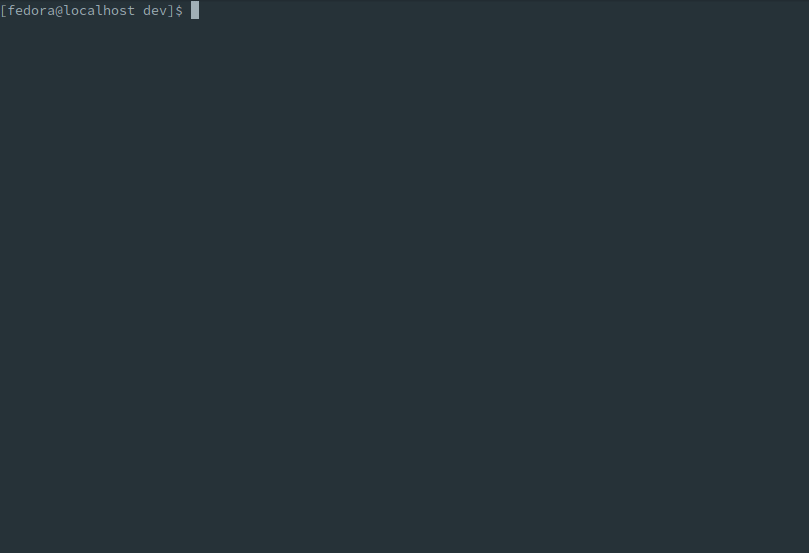

.. _contributing:

Contributing to ARA
===================

`ARA Records Ansible <https://ara.recordsansible.org>`_ is a free and open
source community project that welcomes and appreciates contributions.

While this page focuses around development of the project itself, contributions
aren't only about pull requests, code or code reviews.

They can be in the form of documentation, feedback and comments, suggestions and
ideas, issues and bug reports, or just helping out other users in the
`chat rooms <https://ara.recordsansible.org/community/>`_.

Code contributions
------------------

Pull requests welcome
~~~~~~~~~~~~~~~~~~~~~

ara is hosted at https://codeberg.org/ansible-community/ara thanks
to `codeberg.org <https://codeberg.org/about>`_, a community deployment of `Forgejo <https://forgejo.org/>`_.

ara has a number of other repositories as well, including:

- https://codeberg.org/ansible-community/ara-infra (for things like the website and the live demo)
- https://codeberg.org/ansible-community/ara-collection (for the ara Ansible collection)

Opening a pull request on Codeberg is similar to GitHub and GitLab.
Documentation is available to get started: https://docs.codeberg.org/collaborating/pull-requests-and-git-flow/

At a high level the process looks like this:

- Fork the `ara repository on Codeberg <https://codeberg.org/ansible-community/ara>`_
- Run ``git clone`` on your fork
- Create a new branch: ``git checkout -b cool_feature``
- Do your changes and test or preview them locally, as appropriate
- Commit your changes with ``git commit``
- Push your commit to your fork with ``git push origin cool_feature``
- Open a pull request using the proposed link returned by the ``git push`` command

Every every pull request is automatically tested with linters, unit tests
as well as a variety of integration test scenarios.

This results in higher standards, better code, improved testing coverage,
less regressions and increased stability.

Testing changes locally
~~~~~~~~~~~~~~~~~~~~~~~

It is encouraged to test changes in a local environment before sending them
for review.

Most of the tests that are run against a pull request are fast and can be run
from your development environment without any changes to the system.

`Tox <https://pypi.org/project/tox/>`_ handles the creation of a python virtual
environment in which the tests are run from and must be installed:

- ``tox -e py3`` for unit tests
- ``tox -e linters`` for pep8/flake8/bandit/bashate/black/isort/etc
- ``tox -e docs`` for testing and building documentation to ``docs/build/html``
- ``tox -e ansible-integration`` installs ansible and runs integration tests

Changes to the server, API, Ansible plugins or web interface can generally be
manually tested and previewed from within a tox virtual environment like this:

.. code-block:: bash

    tox -e ansible-integration --notest
    source .tox/ansible-integration/bin/activate
    export ANSIBLE_CALLBACK_PLUGINS=$(python3 -m ara.setup.callback_plugins)
    export ANSIBLE_ACTION_PLUGINS=$(python3 -m ara.setup.action_plugins)
    export ANSIBLE_LOOKUP_PLUGINS=$(python3 -m ara.setup.lookup_plugins)
    ansible-playbook tests/integration/smoke.yaml
    ara-manage runserver
    # Browse to http://127.0.0.1:8000

CI jobs and how they work
~~~~~~~~~~~~~~~~~~~~~~~~~

A `forgejo-runner <https://forgejo.org/docs/latest/admin/actions/runner-installation/>`_
is set up to run Forgejo actions on each pull request.

The code for the Forgejo workflows and Ansible playbooks is in the git repository:
https://codeberg.org/ansible-community/ara/src/branch/master/.forgejo

For the ara repository there are currently five jobs that run on pull requests:

- tests/unit-tests (runs ``tox -e py3``)
- tests/linters (runs ``tox -e linters``)
- tests/docs (runs ``tox -e docs``)
- tests/ansible-integration (runs ``tox -e ansible-integration``)
- tests/container-images (builds and tests `container images <https://codeberg.org/ansible-community/ara/src/branch/master/contrib/container-images>`_)

These jobs run from a fedora-42 based container image spun up by the forgejo runner in podman.
The script to build this image is available here: https://codeberg.org/ansible-community/ara/src/branch/master/contrib/container-images/fedora-ci-image.sh.

It is built periodically and published on Codeberg: https://codeberg.org/ansible-community/-/packages/container/ara%2Ffedora-ci-image/latest

For ``tests/container-images``, we go a step further: we create an OpenStack VM with Ansible,
synchronize the git repo on it and then run the job there instead.
This prevents relying on "docker in docker" and paves the way to test different scenarios
against multiple distributions with ara-collection.

Finally, where relevant and possible, jobs that run Ansible integration tests
use ara to record playbook results to https://demo.recordsansible.org.

This provides simple reporting with labels for pull requests or git commits, for example:

- https://demo.recordsansible.org/?label=sha:e6b30062c68847eb0a4b6a6617ab01078fe176c1
- https://demo.recordsansible.org/?label=ref:refs/pull/604/head
