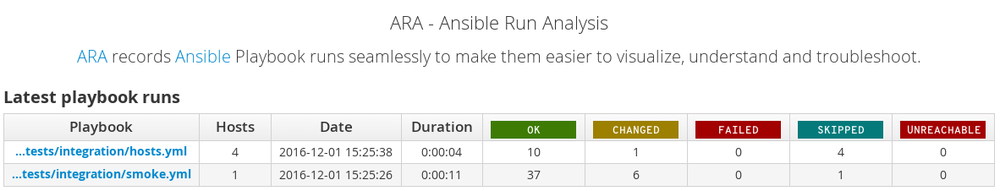
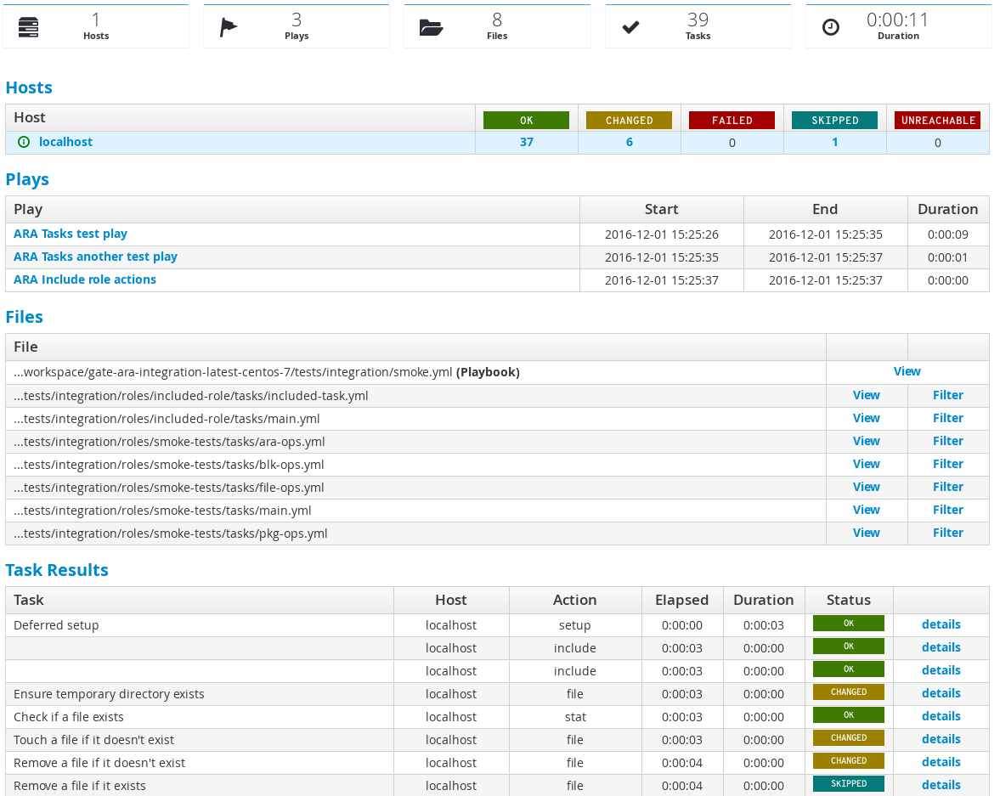
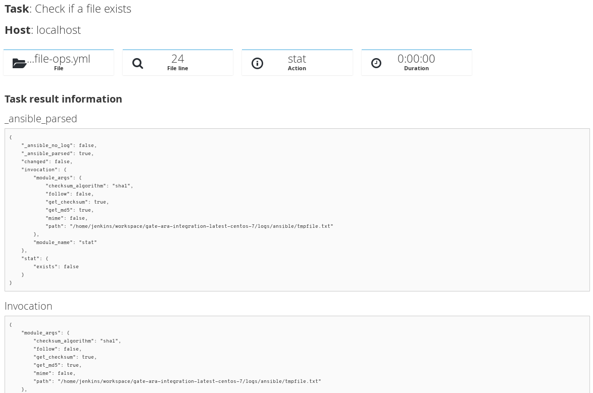
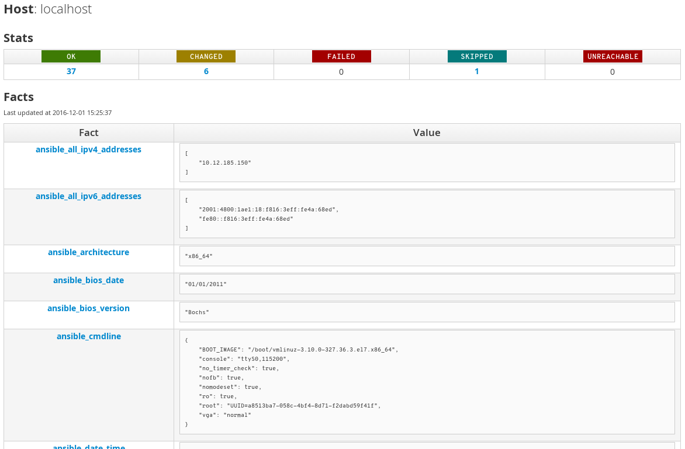
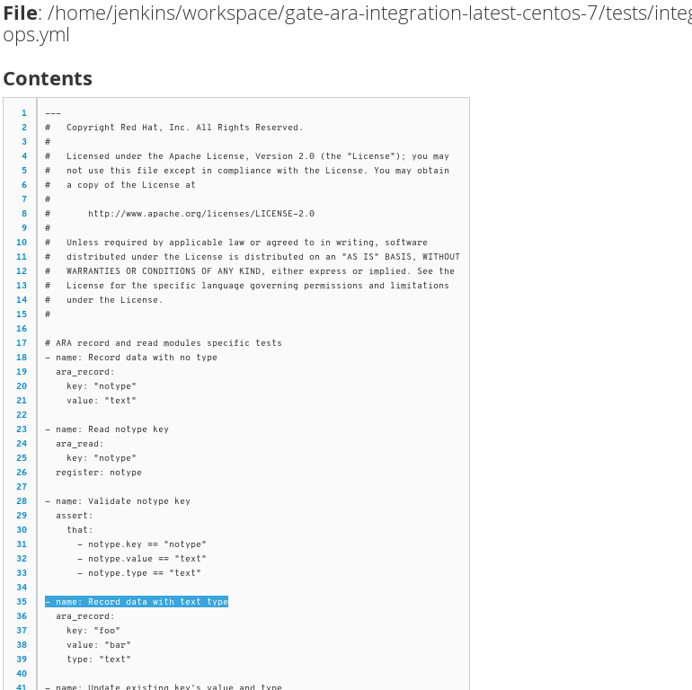
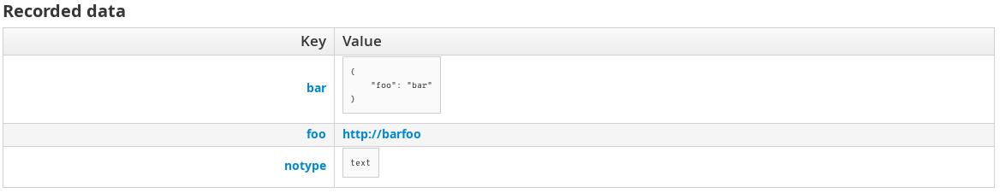

FAQ
===

What is ARA ?
-------------

ARA_ makes Ansible_ runs easier to visualize, understand and troubleshoot.

ARA provides four things:

1. An `Ansible callback plugin`_ to record playbook runs into a local or remote database
2. The ara_record_ and ara_read_ pair of Ansible modules to record and read persistent data with ARA
3. A `CLI client`_ to query the database
4. A `dynamic, database-driven web interface`_ that can also be `generated and served from static files`_

.. _ARA: https://github.com/openstack/ara
.. _Ansible: https://www.ansible.com/
.. _Ansible callback plugin: https://ara.readthedocs.io/en/latest/configuration.html#ansible
.. _ara_record: http://ara.readthedocs.io/en/latest/usage.html#using-the-ara-record-module
.. _ara_read: http://ara.readthedocs.io/en/latest/usage.html#using-the-ara-read-module
.. _CLI client: https://ara.readthedocs.io/en/latest/usage.html#querying-the-database-with-the-cli
.. _dynamic, database-driven web interface: https://ara.readthedocs.io/en/latest/faq.html#what-does-the-web-interface-look-like
.. _generated and served from static files: https://ara.readthedocs.io/en/latest/usage.html#generating-a-static-version-of-the-web-application

What versions of Ansible are supported ?
----------------------------------------

The minimum required version of Ansible to run ARA is 2.1.0.0.

ARA is developed, tested and used with Ansible 2.1.x and 2.2.x.
Ansible 2.0.x is `no longer supported`_.

.. _no longer supported: https://groups.google.com/forum/#!topic/ansible-devel/6-6FdxZ94kc

What's an Ansible callback ?
----------------------------

`Ansible Callbacks`_ are essentially hooks provided by Ansible. Ansible will
send an event and you can react to it with a callback.
You could use a callback to do things like print additional details or, in the
case of ARA, record the playbook run data in a database.

.. _Ansible Callbacks: http://docs.ansible.com/ansible/developing_plugins.html

What does the web interface look like ?
---------------------------------------

A video is available on YouTube_, featuring playbook runs from the
OpenStack-Ansible_ project.

.. _YouTube: https://www.youtube.com/watch?v=zT1l-rFne-Q
.. _OpenStack-Ansible: https://github.com/openstack/openstack-ansible

Otherwise, here's some screenshots highlighting some of ARA's features:

Playbook listing
~~~~~~~~~~~~~~~~

List either all recorded playbooks or only the most recent ones:

Playbook results
~~~~~~~~~~~~~~~~

Filter your playbook results by host, play, task, status, file and more:

Detailed task results
~~~~~~~~~~~~~~~~~~~~~

If necessary, dig into the full readable details of your tasks as if Ansible
was *way* too verbose:

Recorded host facts
~~~~~~~~~~~~~~~~~~~

If you're gathering facts throughout your playbooks, ARA will pick those up
and make them available:

Full playbook and task files
~~~~~~~~~~~~~~~~~~~~~~~~~~~~

ARA will store the full playbook file as well as your standalone or role task
files so you can see exactly what run:

Arbitrarily recorded data
~~~~~~~~~~~~~~~~~~~~~~~~~

The ara_record_ and ara_read_ built-in Ansible modules allow you to write and
read arbitrary data, making them available in the web interface as well:

Why is ARA being developed ?
----------------------------
Ansible is an awesome tool. It can be used for a lot of things.

Reading and interpreting the output of an ansible-playbook run, especially one
that is either long running, involves a lot of hosts or prints a lot of output
can be tedious.
This is especially true when you happen to be running Ansible hundreds of times
during the day, through automated means -- for example when doing continuous
integration or continuous delivery.

ARA aims to do one thing and do it well: Record Ansible runs and provide means
to visualize these records to help you be more efficient.

Why don't you use Ansible Tower, Rundeck or Semaphore ?
-------------------------------------------------------

`Ansible Tower`_ is currently a product from Ansible and has not been open
sourced (*yet*). We do not know when it will be made freely available and it's
source opened.

Ansible Tower, Semaphore_ and Rundeck_ all have something in common.
They are tools that controls (or wants to control) the whole workflow
from end-to-end and they do so in a fairly "centralized" fashion where
everything runs from the place where the software is hosted.
Inventory management, ACLs, playbook execution, editing features and so on.

Since they are the ones actually running Ansible, it makes sense that they can
record and display the data in an organized way.

ARA is decentralized and self-contained: ``pip install ara``, configure the
callback in ``ansible.cfg``, run a playbook and it'll be recorded, wherever it
is. ARA doesn't want to do things like inventory management, provide editing
features or control the workflow. It just wants to record data and provide an
intuitive interface for it.

When using ARA, you can store and browse your data locally and this is in fact
the default behavior. You are not required to use a central server or upload
your data elsewhere.

While the features provided by Tower and other products are definitely nice,
the scope of ARA is kept narrow on purpose.
By doing so, ARA remains a relatively simple application that is very easy to
install and configure. It does not require any changes to your setup or
workflow, it adds itself in transparently and seamlessly.

.. _Ansible Tower: https://www.ansible.com/tower
.. _Semaphore: https://github.com/ansible-semaphore/semaphore
.. _Rundeck: http://rundeck.org/plugins/ansible/2016/03/11/ansible-plugin.html

Can ARA be used outside the context of OpenStack or continuous integration ?
----------------------------------------------------------------------------

Of course, you can.

ARA has no dependencies or requirements with OpenStack or Jenkins for CI.
You can use ARA with Ansible for any playbook in any context.

ARA is completely generic but was developed out of necessity to make
troubleshooting OpenStack continuous integration jobs faster and easier.