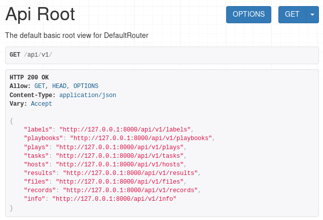
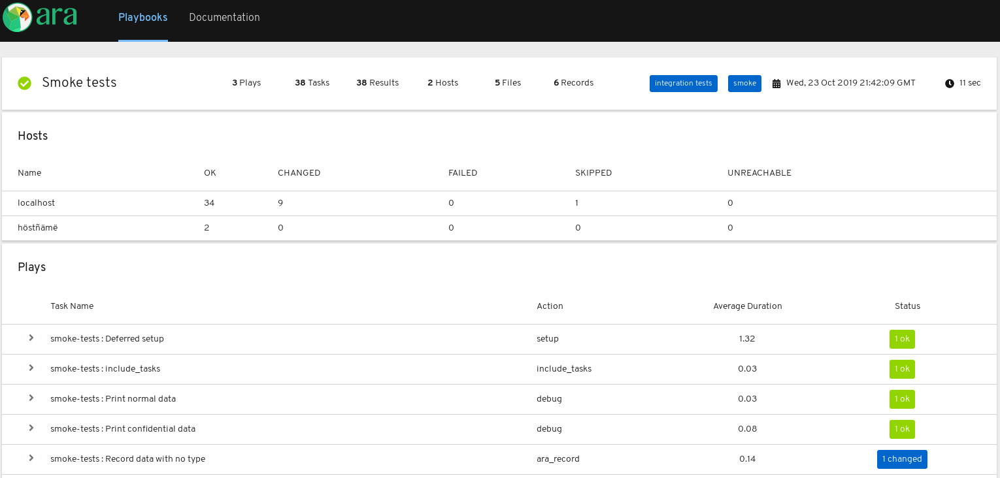

FAQ
===

Where is the source code ?
--------------------------

ARA is currently composed of three different free and open source projects:

- https://github.com/ansible-community/ara for the REST API server and Ansible plugins
- https://github.com/ansible-community/ara-web for the standalone web interface
- https://github.com/ansible-community/ara-infra for project-specific infrastructure needs (such as the `ara.recordsansible.org <https://ara.recordsansible.org>`_ website)

How does ARA record data from Ansible ?
---------------------------------------

ARA Records Ansible playbooks through an Ansible `callback plugin`_.

.. image:: _static/graphs/recording-workflow.png

0. ARA is installed and Ansible is configured to use the callback plugin
1. An ``ansible-playbook`` command is executed
2. Ansible triggers the callback plugin for every event (``v2_playbook_on_start``, ``v2_runner_on_failed``, etc.)
3. The relevant information is retrieved from the Ansible playbook execution context and is sent to the API server
4. The API server validates and serializes the data before storing it the configured database backend
5. The API server sends a response back to the API client with the results
6. The callback plugin returns, ending the callback hook
7. Ansible continues running the playbook until it fails or is completed (back to step 2)

Once the data has been saved in the database, it is made available for query by
the API.

.. _callback plugin: https://docs.ansible.com/ansible/latest/plugins/callback.html

How can we browse the data recorded by ARA ?
--------------------------------------------

There are currently three ways to browse data recorded by ARA:

Built-in REST API Browser
~~~~~~~~~~~~~~~~~~~~~~~~~

The ARA API server ships with a built-in REST API browser provided by `django-rest-framework <https://www.django-rest-framework.org/>`_.

Built-in simple interface
~~~~~~~~~~~~~~~~~~~~~~~~~

ARA also provides a simple, but limited, interface for use cases that do not need or require features provided by ara-web.

.. image:: ../source/_static/ui-built-in.png

ara-web
~~~~~~~

ara-web_ is a stateless javascript API client interface built with react.
It queries a running API server to provide reporting and visualization of playbook runs.

Are there live demos available ?
--------------------------------

Yes, you can find persistent and up-to-date live demos at
`api.demo.recordsansible.org <https://api.demo.recordsansible.org>`_ for the
API and `web.demo.recordsansible.org <https://web.demo.recordsansible.org>`_ for
the ara-web_ standalone interface.

What's an Ansible callback ?
----------------------------

`Ansible Callbacks`_ are essentially hooks provided by Ansible. Ansible will
send an event and you can react to it with a callback.
You could use a callback to do things like print additional details or, in the
case of ARA, record the playbook run data in a database.

.. _Ansible Callbacks: https://docs.ansible.com/ansible/dev_guide/developing_plugins.html

What versions of Ansible are supported ?
----------------------------------------

The upstream Ansible community and maintainers provide support for the latest
three major stable releases and ARA follows the same support cycle.

For example, if the latest version of Ansible is 2.9, then the latest release
of ARA will support 2.9 as well as 2.8 and 2.7.

For more information on Ansible's release and maintenance cycle, you can refer
to the `Ansible documentation <https://docs.ansible.com/ansible/latest/reference_appendices/release_and_maintenance.html>`_.

If you are using a release of Ansible that is no longer supported, it doesn't
mean that ARA won't work but it will no longer be tested. We strongly encourage
you to upgrade as soon as possible in order to benefit from the latest features
and security fixes not just in ARA but in Ansible as well.

Older unsupported versions of Ansible can contain unfixed security
vulnerabilities (*CVE*).

Why ARA instead of <X> ?
------------------------

Ansible is an awesome tool. It can be used for a lot of things.

Reading and interpreting the output of an ``ansible-playbook`` run, especially
one that is either long running, involves a lot of hosts or prints a lot of
output can be hard to understand and troubleshoot.

This is especially true when you happen to be running Ansible hundreds of times
during the day, through automated means -- for example when doing continuous
integration or continuous delivery.

ARA aims to do one thing and do it well: Record Ansible playbooks and provide
you with the tools you need to make your playbook results intuitive for you and
for your systems.

The great thing about ARA is that it is not mutually exclusive with other
software and systems you might already be using Ansible with today.

There is nothing preventing you from using ARA with other tools such as `Ansible
Tower`_ (or AWX_), Zuul_, Jenkins_ or Rundeck_ since all you need to get started is
to install and enable the ARA Ansible callback plugin.

.. _Ansible Tower: https://www.ansible.com/tower
.. _AWX: https://github.com/ansible/awx
.. _Zuul: https://zuul-ci.org
.. _Jenkins: https://www.redhat.com/en/blog/integrating-ansible-jenkins-cicd-process
.. _Rundeck: https://www.rundeck.com/ansible

Can I set up the different components of ARA on different servers ?
-------------------------------------------------------------------

Yes.

The defaults are set to have the callback use the offline API client which
expects the server dependencies installed and the data is saved to a local
sqlite database.

However, the callback can also be configured to send data to a specified API
server address and the API server can be configured to use a remote database
server such as PostgreSQL or MySQL.

The web client interface provided by ara-web_ is stateless and requires an API
server address to connect to.
It can be installed anywhere that has access to the API server.

.. _ara-web: https://github.com/ansible-community/ara-web
