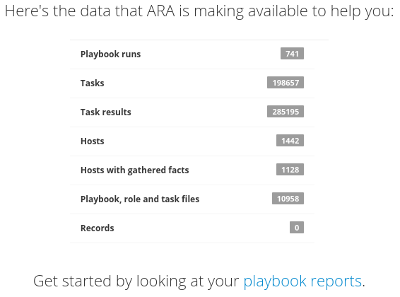
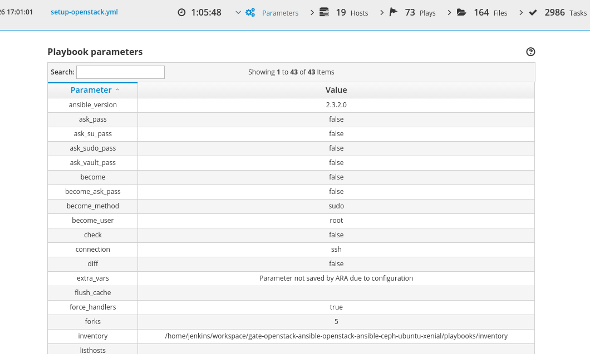
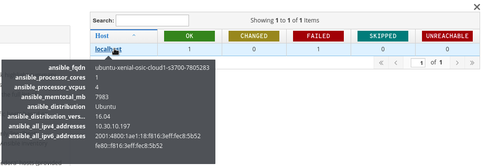
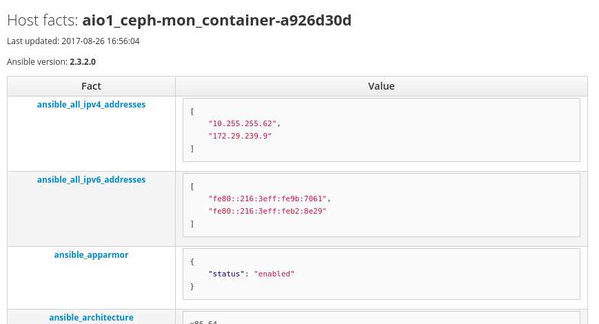
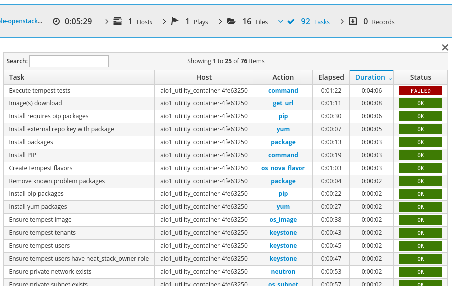
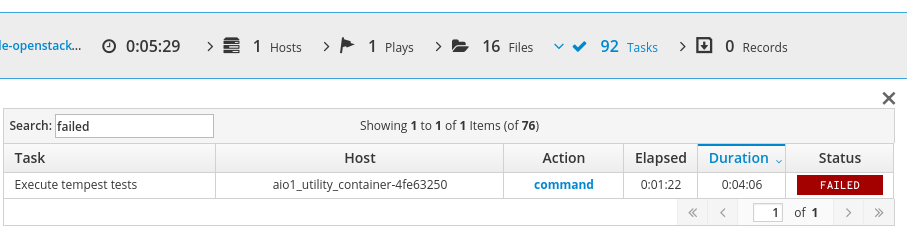
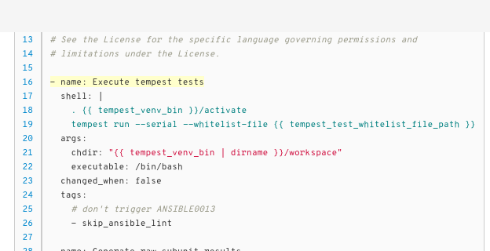
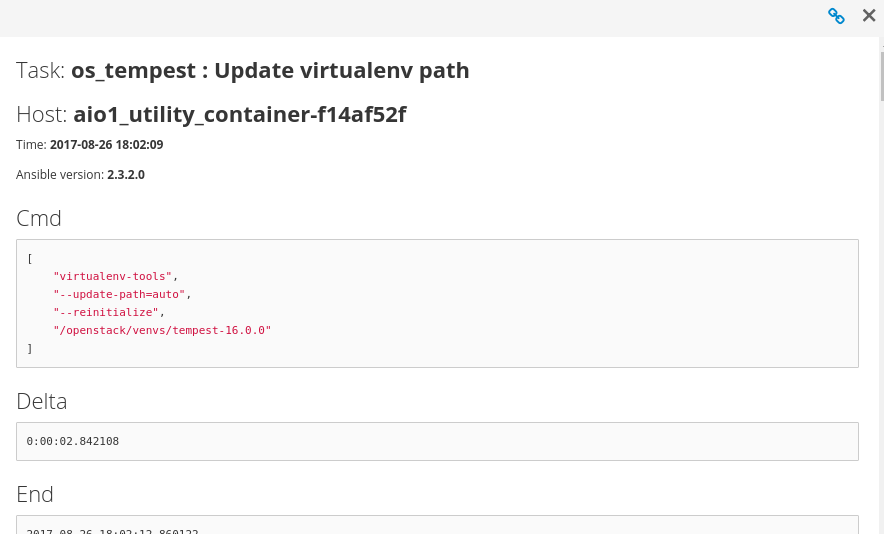
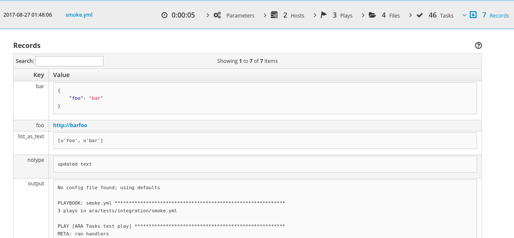

.. _faq:

FAQ
===

What is ARA ?
-------------

ARA_ makes Ansible_ runs easier to visualize, understand and troubleshoot.

ARA provides four things:

1. An :ref:`Ansible callback plugin <configuration_ansible>` to record playbook runs into a local or remote database
2. The :ref:`ara_record <ara_record>` and :ref:`ara_read <ara_read>` pair of Ansible modules to record and read persistent data with ARA
3. A :ref:`CLI client <cli_client>` to query the database
4. A :ref:`dynamic, database-driven web interface <interface_preview>` that can also be :ref:`generated and served from static files <generating_html>`

.. _ARA: https://github.com/openstack/ara
.. _Ansible: https://www.ansible.com/

.. _interface_preview:

What does the web interface look like ?
---------------------------------------

A video preview and explanation of the web interface is available on
YouTube_, featuring playbook runs from the OpenStack-Ansible_ project.

.. _YouTube: https://www.youtube.com/watch?v=k3i8VPCanGo
.. _OpenStack-Ansible: https://github.com/openstack/openstack-ansible

Otherwise, here's some screenshots highlighting some of ARA's features:

Home page
~~~~~~~~~

The home page highlights the data recorded by ARA:

Playbook reports
~~~~~~~~~~~~~~~~

The core of the web application interface revolves around one and single page
where you’ll be able to find all the information about your playbooks:

.. image:: _static/reports.png

Ansible parameters
~~~~~~~~~~~~~~~~~~

ARA stores parameters and options passed to your ansible-playbook command:

Playbook host summary
~~~~~~~~~~~~~~~~~~~~~

Quickly have a glance at summary statistics or host facts for your playbook:

Recorded host facts
~~~~~~~~~~~~~~~~~~~

If Ansible gathered facts as part of your playbook, ARA will save them and
make them available:

Organized task results
~~~~~~~~~~~~~~~~~~~~~~

Quickly and easily get insight into your task results.

**Sort them by duration to find which took the longest time**

**Search and filter by task name, host, action or status**

**Click on the action to get context on where a specific task ran**

**Click on the status to dig into all the data made available by Ansible**

Arbitrarily recorded data
~~~~~~~~~~~~~~~~~~~~~~~~~

The :ref:`ara_record <ara_record>` and :ref:`ara_read <ara_read>` built-in
Ansible modules allow you to write and read arbitrary data, making them
available in the web interface:

What versions of Ansible are supported ?
----------------------------------------

The upstream Ansible community and maintainers provide support for the latest
two major stable releases and ARA follows the same support cycle.

At this time, the minimum required version of Ansible to run the latest version
of ARA is **2.2.0.0**.
New development is tested against the latest versions of **2.2**, **2.3** as
well as ``devel`` which is currently the future version of Ansible, **2.4**.

If you are using a release of Ansible that is no longer supported, we strongly
encourage you to upgrade as soon as possible in order to benefit from the
latest features and security fixes.

Older unsupported versions of Ansible can contain unfixed security
vulnerabilities (*CVE*).

Does ARA support running on Python 3 ?
--------------------------------------

Yes.

The support for running ARA on a python 3 environment landed in ARA 0.14.0.
Previous versions would not work on python 3.

.. _faq_callback:

What's an Ansible callback ?
----------------------------

`Ansible Callbacks`_ are essentially hooks provided by Ansible. Ansible will
send an event and you can react to it with a callback.
You could use a callback to do things like print additional details or, in the
case of ARA, record the playbook run data in a database.

.. _Ansible Callbacks: https://docs.ansible.com/ansible/dev_guide/developing_plugins.html

Why is ARA being developed ?
----------------------------
Ansible is an awesome tool. It can be used for a lot of things.

Reading and interpreting the output of an ``ansible-playbook`` run, especially
one that is either long running, involves a lot of hosts or prints a lot of
output can be tedious.
This is especially true when you happen to be running Ansible hundreds of times
during the day, through automated means -- for example when doing continuous
integration or continuous delivery.

ARA aims to do one thing and do it well: Record Ansible runs and provide means
to visualize these records to help you be more efficient.

Why don't you use Ansible Tower, Rundeck or Semaphore ?
-------------------------------------------------------

`Ansible Tower`_ is a product from Red Hat that has not been open sourced
(*yet*). We do not know when it will be made freely available or when it will
become open source.

Ansible Tower, Semaphore_ and Rundeck_ all have something in common.
They are tools that control (or want to control) the whole workflow from
end-to-end and they do so in a fairly "centralized" fashion where everything
runs from the place where the software is hosted.

They provide features like inventory management, ACLs, playbook execution,
editing features and so on.

Since they are the ones actually running Ansible, it makes sense that they can
record and display the data in an organized way.

ARA is decentralized and self-contained: ``pip install ara``, configure the
callback in ``ansible.cfg``, run a playbook and it'll be recorded, wherever it
is. ARA doesn't want to do things like inventory management, provide editing
features or control the workflow. It just wants to record data and provide an
intuitive interface for it.

When using ARA, you can store and browse your data locally and this is in fact
the default behavior. You are not required to use a central server or upload
your data elsewhere.

While the features provided by Tower and other products are definitely nice,
the scope of ARA is kept narrow on purpose.
By doing so, ARA remains a relatively simple application that is very easy to
install and configure. It does not require any changes to your setup or
workflow, it adds itself in transparently and seamlessly.

For more information regarding the core values and the scope for the ARA
project, refer to the project :ref:`manifesto <manifesto>`.

.. _Ansible Tower: https://www.ansible.com/tower
.. _Semaphore: https://github.com/ansible-semaphore/semaphore
.. _Rundeck: http://rundeck.org/plugins/ansible/2016/03/11/ansible-plugin.html

Can Ansible with ARA run on a different server than the web application ?
-------------------------------------------------------------------------

ARA comes bundled in an all-in-one package: callback, modules, web application
and command line interface. When you install ARA, you get all of those out of
the box.

The ARA components themselves are mostly decoupled, however, and as long as
they can all communicate with the same database, you'll get the same
experience.

You can run Ansible with ARA on your laptop, save to a local sqlite database
and run the web application from the embedded server, everything offline, if
that's what you need.

However, you can also, for example, use a
:ref:`MySQL configuration <ARA_DATABASE>` to have Ansible and ARA send data
to a remote database server instead.

Another server could host the web application with
:ref:`Apache+mod_wsgi <webserver_configuration>` with the same database
configuration and you would be accessing the same recorded data.

You could also have ARA installed on yet another computer with the same
configuration and the command line interface will be able to retrieve the data
automatically as well.

Can ARA be used outside the context of OpenStack or continuous integration ?
----------------------------------------------------------------------------

ARA has no dependencies or requirements with OpenStack or Jenkins for CI.
You can use ARA with Ansible for any playbook in any context.

ARA is completely generic but was developed out of necessity to make
troubleshooting OpenStack continuous integration jobs faster and easier.
