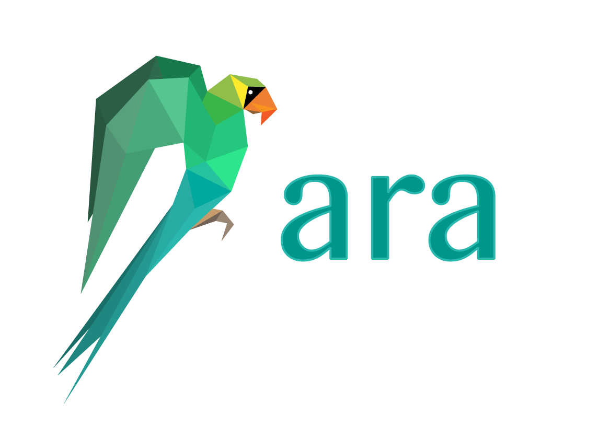

Welcome to the ARA documentation!
=================================

Table of Contents
=================

.. toctree::
    :maxdepth: 3

    Introduction <introduction>
    Getting started <getting-started>
    Ansible: configuration to use ARA <ansible-configuration>
    Ansible: plugins and use cases <ansible-plugins-and-use-cases>
    API: Server configuration <api-configuration>
    API: Authentication and security <api-security>
    API: Endpoint documentation <api-documentation>
    API: Usage with built-in clients <api-usage>
    API: Distributed sqlite backend <distributed-sqlite-backend>
    API: Server container images <container-images>
    CLI: ara and ara-manage <cli>
    Contributing to ARA <contributing>
    Frequently asked questions <faq>
    Troubleshooting <troubleshooting>
    Changelog and release notes <changelog-release-notes>
