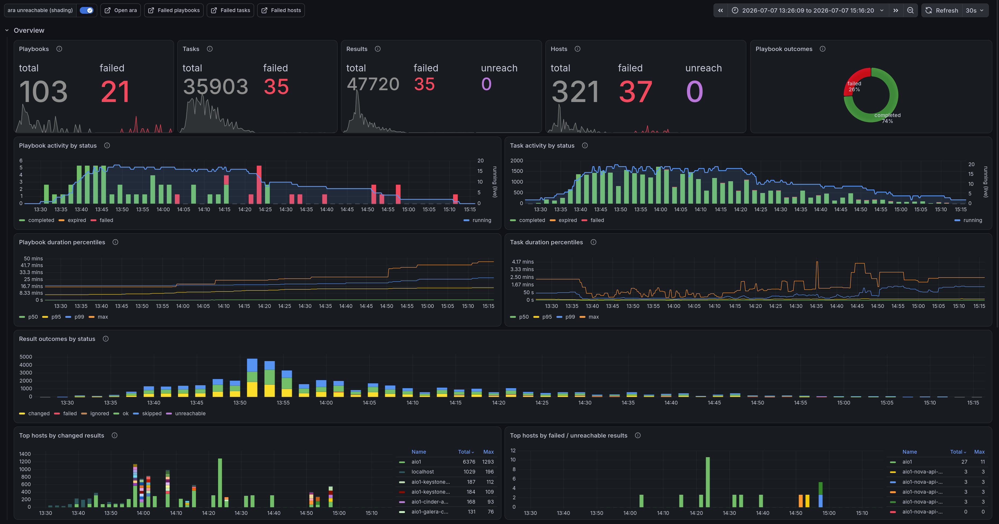
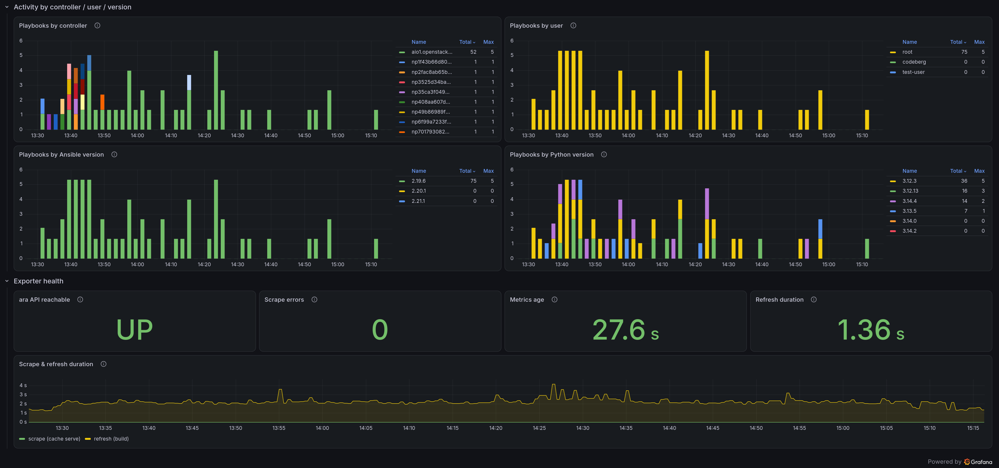

Ansible metrics with Prometheus
===============================

ara doesn't provide monitoring or alerting out of the box (they are out of
scope) but it records a number of granular metrics about Ansible playbooks,
tasks, results and hosts.

The ``ara prometheus`` command exposes a subset of these as
`Prometheus <https://prometheus.io/>`_ metrics so you can graph them in
`Grafana <https://grafana.com/>`_ and alert on them with
`Alertmanager <https://prometheus.io/docs/alerting/latest/alertmanager/>`_.

For example, alerts could fire when playbooks start failing or if hosts
become unreachable.
It makes it possible to visualize playbook status across python or ansible
versions, users and controllers:

*(open images in a new window for full resolution)*

This documentation is about using the prometheus exporter.
Historical and developer-oriented documentation about design and rationale
is available in the
`source repository <https://codeberg.org/ansible-community/ara/src/branch/master/contrib/prometheus/README.rst>`_.

How it works
------------

The exporter is a `prometheus_client
<https://github.com/prometheus/client_python>`_ custom collector. On a
background interval it queries the ara API, builds the full set of metrics and
caches them in memory; every Prometheus scrape of ``/metrics`` is answered
from that cache.

.. code-block:: text

    ┌────────────┐   promql   ┌─────────┐   ┌──────────────────┐
    │ Prometheus │◄───────────┤ Grafana │   │ ansible-playbook │
    └──────┬─────┘            └─────────┘   │    (with ara)    │
           │                                └────────┬─────────┘
           │ scrapes /metrics                        │ records playbooks
           │                                         │
    ┌──────▼───────────────┐    queries     ┌────────▼───────┐
    │  ara prometheus      ├───────────────►│  ara API / DB  │
    │  (exporter)          │    metrics     │                │
    └──────────────────────┘                └────────────────┘

Getting started
---------------

The exporter is not an API server component and does not require an API server
to run. It can read directly from a local ara database (the default
``offline`` client) or query a remote ara API server over HTTP.

Reading from a local ara database:

.. code-block:: bash

    # Install ara, ansible and prometheus_client in a virtual environment
    python3 -m venv ~/venv/ara
    source ~/venv/ara/bin/activate
    pip install ansible "ara[server,prometheus]"

    # Run and record a playbook
    export ANSIBLE_CALLBACK_PLUGINS=$(python3 -m ara.setup.callback_plugins)
    ansible-playbook playbook.yml

    # Start the exporter; metrics are now on http://0.0.0.0:8001/metrics
    ara prometheus

Querying a remote ara API server (ansible and the server dependencies are not
required here):

.. code-block:: bash

    python3 -m venv ~/venv/ara
    source ~/venv/ara/bin/activate
    pip install "ara[prometheus]"

    export ARA_API_CLIENT=http
    export ARA_API_SERVER=https://ara.example.org
    ara prometheus

Then point Prometheus at it (a ready-to-use example is in
``contrib/prometheus/prometheus.yml``):

.. code-block:: yaml

    global:
      scrape_interval: 30s

    scrape_configs:
      - job_name: ara
        static_configs:
          # Replace with wherever the exporter is listening, relative to Prometheus
          - targets: ['localhost:8001']

Metrics become available as soon as Prometheus successfully scrapes once.

Available metrics
-----------------

Status counts (whole database):

.. code-block:: text

    # Playbooks by status (completed, failed, running, expired, unknown)
    ara_playbooks{status="completed"} 128.0
    ara_playbooks{status="failed"} 3.0

    # Tasks by status
    ara_tasks{status="failed"} 12.0

    # Task results by status (ok, failed, skipped, unreachable, unknown)
    ara_results{status="ok"} 5821.0
    ara_results{status="failed"} 12.0
    ara_results{status="unreachable"} 1.0

    # ara derives the status it displays from the stored status plus two
    # booleans: an ok result with changed=true is reported as "changed", and a
    # failed result with ignore_errors=true as "ignored". The exporter mirrors
    # that, so these statuses partition the results the same way ara's UI shows.
    ara_results{status="changed"} 240.0
    ara_results{status="ignored"} 3.0

    # Total host records (a host record is per host, per playbook). The
    # per-status host outcome numbers live in the ara_hosts_by_hostname
    # breakdown below; sum that for host outcome totals.
    ara_hosts 342.0

Recent-window breakdowns (most recent ``--playbook-limit`` playbooks):

.. code-block:: text

    # Number of playbooks the breakdowns below are computed from
    ara_playbooks_window 1000.0

    # Playbooks grouped by controller and status
    ara_playbooks_by_controller{controller="ci-runner-01",status="completed"} 240.0
    ara_playbooks_by_controller{controller="bastion.prod",status="failed"} 2.0

    # Playbooks grouped by ansible_version and status
    ara_playbooks_by_ansible_version{ansible_version="2.17.6",status="completed"} 410.0

    # Playbooks grouped by python_version and status
    ara_playbooks_by_python_version{python_version="3.12.3",status="completed"} 388.0

    # Playbooks grouped by user and status
    ara_playbooks_by_user{user="deploy",status="completed"} 305.0

    # Running totals of playbooks recorded, grouped the same way. Unlike the
    # by_* gauges above (a current-window snapshot), these are monotonic
    # counters, so Grafana uses increase()/rate() on them for exact activity
    # over a range. Use these to graph activity; use the gauges to see the
    # current mix (e.g. the ansible_version mix during an upgrade).
    ara_recorded_playbooks_by_controller_total{controller="ci-runner-01",status="completed"} 24012.0
    ara_recorded_playbooks_by_ansible_version_total{ansible_version="2.17.6",status="completed"} 41090.0
    ara_recorded_playbooks_by_python_version_total{python_version="3.12.3",status="completed"} 38855.0
    ara_recorded_playbooks_by_user_total{user="deploy",status="completed"} 30512.0

    # Playbook duration distribution over the window (a gauge histogram, in
    # seconds) plus the exact max. Grafana can compute quantiles from the
    # buckets with histogram_quantile() and the average as _gsum / _gcount.
    ara_playbook_duration_seconds_bucket{le="30"} 812.0
    ara_playbook_duration_seconds_bucket{le="+Inf"} 1000.0
    ara_playbook_duration_seconds_gcount 1000.0
    ara_playbook_duration_seconds_gsum 14200.0
    ara_playbook_duration_seconds_max 311.7

Per-hostname breakdown (per-hostname sums over the most recently updated host
records, up to ``--host-limit`` of them):

.. code-block:: text

    # Number of host records the per-hostname series below were summed from
    ara_hosts_window 342.0

    # Each hostname's ok / changed / failed / skipped / unreachable counters,
    # summed over its recent host records (one row per host per playbook). Scope
    # to a time range in Grafana with clamp_min(delta(...), 0).
    ara_hosts_by_hostname{hostname="web.example.org",status="ok"} 529.0
    ara_hosts_by_hostname{hostname="web.example.org",status="skipped"} 1300.0
    ara_hosts_by_hostname{hostname="web.example.org",status="failed"} 1.0

Exporter health:

.. code-block:: text

    # 1 if ara was reachable on the last refresh, 0 otherwise
    ara_up 1.0
    # Time the last refresh spent querying ara and building metrics
    ara_refresh_duration_seconds 0.42
    # Age of the metrics being served (time since the last successful refresh)
    ara_metrics_age_seconds 12.0
    # Time spent answering this scrape (near-zero when served from cache)
    ara_scrape_duration_seconds 0.0004
    # Number of refreshes that failed to collect from ara
    ara_scrape_errors_total 0.0

Freshness and links:

.. code-block:: text

    # Unix start time of the most recently started playbook (any status).
    # Alert on time() minus this to detect that automation has stopped.
    ara_last_playbook_started_timestamp_seconds 1.7831556e+09

    # Unix start time of the oldest playbook still in the running state.
    # Alert on time() minus this to catch playbooks stuck running.
    # (Absent when nothing is currently running.)
    ara_running_playbook_oldest_started_timestamp_seconds 1.783152e+09

    # The ara web address the exporter is reading from, in a label (value is
    # always 1). Emitted only with the http client; used as a Grafana variable
    # to link panels back to the ara web UI.
    ara_api_server{server="https://demo.recordsansible.org"} 1.0

A note on querying for failures over time
-----------------------------------------

The ``ara_*`` counts are *gauges* that reflect the number of rows currently in
the database. To count "how much new activity happened in a window", use
``delta()`` rather than ``increase()``. ``delta()`` is the gauge-appropriate
function (plain first-to-last difference over the range), whereas ``increase()``
is for counters: on a gauge it treats a decrease (for example when a prune or
expiry job removes old rows) as a counter reset and adds it back, producing
spurious spikes and false alerts right after a prune. New playbook runs only add
rows and pruning only removes *old* rows, so ``delta()`` over a short window
reliably reflects newly recorded activity. For example, new task failures in the
last 15 minutes:

.. code-block:: text

    delta(ara_results{status="failed"}[15m])

The one genuine counter among the whole-database counts, ``ara_scrape_errors_total``,
is the exception and should be queried with ``increase()``.

For the recent playbook breakdowns there is also a set of true counters,
``ara_recorded_playbooks_by_controller_total`` and friends. These are monotonic,
so ``increase()`` on them gives *exact* activity per controller / user / version,
without the small inaccuracies ``delta()`` on the equivalent ``ara_playbooks_by_*``
gauges has when the recent window is saturated. Prefer them when graphing or
alerting on activity broken down by one of those labels; use the gauges to see
the current mix.

Grafana dashboard
-----------------

A starter dashboard is provided in
`contrib/grafana/ara-dashboard.json <https://codeberg.org/ansible-community/ara/src/branch/master/contrib/grafana/ara-dashboard.json>`_.

Since every metric is a gauge of current state, the dashboard is built around
*activity in the selected time range* rather than database totals: the stat
panels show how much was recorded in the range (with sparklines), and the
breakdowns show per-interval activity as stacked bars. These remain readable
when playbooks run intermittently, since quiet periods are simply empty so it
answers "what is happening now" rather than "how much is in the database". The
overview stat boxes each pair a total with its failure count (playbooks with
failed, results and hosts also with unreachable) so failures are visible at a
glance without separate panels. It has an overview section (playbook outcomes donut,
playbook and result activity split by status, top hosts by changed and by
failed / unreachable results from host records updated in the range, and
duration percentiles), a section breaking playbooks down by controller / user /
ansible version / python version, and exporter health. Import it in Grafana and
select your Prometheus data source when prompted.

Everyone is encouraged to tweak it to their needs. Feel free to
:ref:`open a pull request <contributing:Contributing to ARA>` if you improve it.

Alerting
--------

Example Prometheus alerting rules are provided in
``contrib/prometheus/ara-alerts.yml`` and cover the cases most relevant to
production monitoring:

- the exporter being down, unable to reach ara, or serving stale metrics
  (refreshes persistently failing),
- new playbook and task result failures (including a per-controller variant
  for routing alerts to the right team),
- a sustained high playbook failure ratio,
- unreachable hosts,
- and an optional watchdog for when no new playbooks have been recorded in a
  while.

Load them from your ``prometheus.yml`` and wire up Alertmanager:

.. code-block:: yaml

    rule_files:
      - ara-alerts.yml

    alerting:
      alertmanagers:
        - static_configs:
            - targets: ['localhost:9093']
