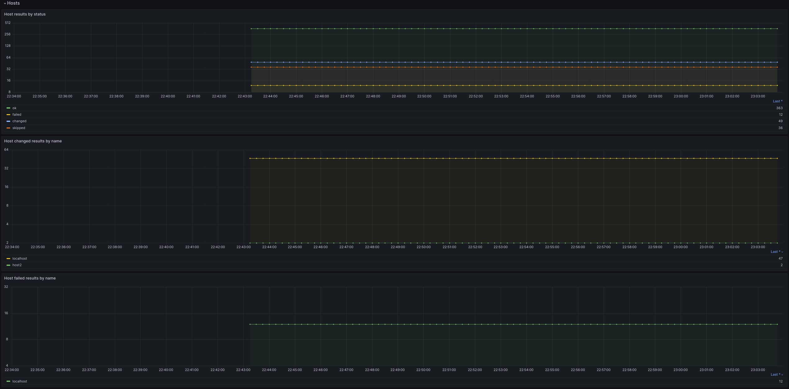

Ansible metrics with Prometheus
===============================

ara doesn't provide monitoring or alerting out of the box (they are out of scope) but it records a number of granular metrics about Ansible playbooks, tasks and hosts, amongst other things.

Starting with version 1.6.2, ara provides an integration of `prometheus_client <https://github.com/prometheus/client_python>`_ that queries the ara API and then exposes these metrics for prometheus to scrape.

Once these metrics are in `Prometheus <https://prometheus.io/>`_, they're available for queries, alerts and pretty graphs in `Grafana <https://grafana.com/>`_.

The source code for the exporter can be found in the `git repository <https://github.com/ansible-community/ara/blob/master/ara/cli/prometheus.py>`_.

Getting started
---------------

The ara prometheus exporter implementation is not an API server component and does not require an API server to run by default.

It can run out of an installation from distribution packages, PyPI packages in a virtual environment or from a container.

For example:

.. code-block:: bash

    # Install ara, ansible and prometheus_client in a virtual environment
    python3 -m venv ~/venv/ara
    source ~/venv/ara/bin/activate
    pip install ansible ara[server,prometheus]

    # Run and record a playbook
    export ANSIBLE_CALLBACK_PLUGINS=$(python3 -m ara.setup.callback_plugins)
    ansible-playbook ~/docs.yml

    # Start the prometheus exporter
    ara prometheus
    # http://127.0.0.1:8001/metrics available with metrics from running ~/docs.yml

When running an ara API server, the prometheus exporter can be installed and run from wherever it is able to query the API.

For example:

.. code-block:: bash

    # Install ara and prometheus_client in a virtual environment
    # (ansible and the ara API server dependencies are not required here)
    python3 -m venv ~/venv/ara
    source ~/venv/ara/bin/activate
    pip install ara[prometheus]

    # Configure the prometheus exporter to query a running instance
    export ARA_API_CLIENT=http
    export ARA_API_SERVER=http://ara.example.org

    # Start the prometheus exporter, backfilling metrics from the last 30 days
    # and then polling for new data every 30 seconds
    ara prometheus --max-days 30 --poll 30
    # http://127.0.0.1:8001/metrics available with metrics from ara.example.org

Once the exporter is running, Prometheus must be configured to scrape it:

.. code-block:: yaml

    global:
      scrape_interval: 30s

    scrape_configs:
      - job_name: 'ara'
        static_configs:
          # Replace with wherever the exporter is available and listening relative to prometheus
          - targets: ['10.0.0.10:8001']

Metrics should then be available as soon as Prometheus successfully scrapes at least once.

Available metrics
-----------------

The ``ara prometheus`` command queries the ara API and then makes the following metrics available:

- **ara_playbooks** (`Summary <https://prometheus.io/docs/concepts/metric_types/#summary>`_) provides labels based on playbook properties and duration in seconds

.. code-block::

    ara_playbooks_count{ansible_version="2.15.0",client_version="1.6.2.dev10",controller="fedora",name="docs",path="/home/user/docs.yml",python_version="3.11.3",server_version="1.6.2.dev10",status="completed",updated="2023-06-08T02:43:29.910977Z",user="ansible"} 1.0
    ara_playbooks_sum{ansible_version="2.15.0",client_version="1.6.2.dev10",controller="fedora",name="docs",path="/home/user/docs.yml",python_version="3.11.3",server_version="1.6.2.dev10",status="completed",updated="2023-06-08T02:43:29.910977Z",user="ansible"} 14.161331

- **ara_tasks** (`Summary <https://prometheus.io/docs/concepts/metric_types/#summary>`_) provides labels based on task properties and duration in seconds

.. code-block::

    ara_tasks_count{action="command",name="docs",path="/home/user/docs.yml",playbook="30",status="completed",updated="2023-06-08T02:43:29.665787Z"} 1.0
    ara_tasks_sum{action="command",name="docs",path="/home/user/docs.yml",playbook="30",status="completed",updated="2023-06-08T02:43:29.665787Z"} 0.29482

- **ara_hosts_{ok,failed,changed,skipped,unreachable}** (`Gauge <https://prometheus.io/docs/concepts/metric_types/#gauge>`_) provide labels based on host properties and number of results for each status

.. code-block::

    ara_hosts_ok{name="localhost",playbook="30",updated="2023-06-08T02:43:29.848077Z"} 36.0
    ara_hosts_failed{name="localhost",playbook="24",updated="2023-06-08T02:32:18.773096Z"} 1.0
    ara_hosts_changed{name="localhost",playbook="30",updated="2023-06-08T02:43:29.848077Z"} 10.0
    ara_hosts_skipped{name="host3",playbook="15",updated="2023-06-08T01:24:59.210984Z"} 2.0
    ara_hosts_unreachable{name="localhost",playbook="24",updated="2023-06-08T02:32:18.773096Z"} 1.0

Grafana dashboard
-----------------

While everyone is encouraged to create and tweak their own dashboards according to their needs and preferences, the community maintains a Grafana dashboard to help users get started.

It is in `contrib <https://github.com/ansible-community/ara/blob/master/contrib/grafana/ara-dashboard.json>`_ inside the git repository.
Feel free to :ref:`open a pull request <contributing>` if you'd like to contribute !

The dashboard contains a high level overview of available metrics for playbooks, tasks and hosts.

Open these screenshots in a new tab for viewing them in full resolution:

.. image:: ../source/_static/grafana-tasks.png

