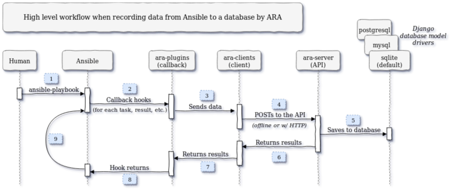

Troubleshooting
===============

This page documents issues that are commonly encountered and provides advice on
how to troubleshoot them.

Increasing verbosity and obtaining debug logging
------------------------------------------------

When there is an exception, an error or something doesn't work, it is likely that
increasing verbosity or looking at the debug logs can point us in the right direction.

The ``ansible`` and ``ansible-playbook`` commands do not run with enough verbosity
by default to display tracebacks from Ansible plugins.

In order to retrieve the tracebacks, run these commands with increased verbosity (``-vvv``):

.. code-block:: bash

    > ansible-playbook playbook.yml
    # ...
    TASK [Gathering Facts] *****************************************************
    [WARNING]: Failure using method (v2_playbook_on_task_start) in callback plugin (<ansible.plugins.callback.ara_default.CallbackModule object at 0x7f6d4abcfe50>):
    # ...

    > ansible-playbook -vvv playbook.yml
    # ...
    TASK [Gathering Facts] *****************************************************
    [WARNING]: Failure using method (v2_playbook_on_task_start) in callback plugin (<ansible.plugins.callback.ara_default.CallbackModule object at 0x7f1e7fd5ce50>):
    Callback Exception: 
      File "/usr/lib/python3.9/site-packages/ansible/executor/task_queue_manager.py", line 389, in send_callback
        method(*new_args, **kwargs)
      File "/usr/lib/python3.9/site-packages/ara/plugins/callback/ara_default.py", line 354, in v2_playbook_on_task_start
        raise Exception
    # ...

Additional debug logging from ara's perspective can be added by setting :ref:`api-configuration:ARA_DEBUG` to ``true``
and :ref:`api-configuration:ARA_LOG_LEVEL` to ``DEBUG``:

.. code-block:: bash

    > export ARA_DEBUG=true
    > export ARA_LOG_LEVEL=DEBUG
    > export ANSIBLE_CALLBACK_PLUGINS=$(python3 -m ara.setup.callback_plugins)
    > ansible-playbook tests/integration/hosts.yaml

    [WARNING]: No inventory was parsed, only implicit localhost is available
    [WARNING]: provided hosts list is empty, only localhost is available. Note that the implicit localhost does not match 'all'
    Operations to perform:
    Apply all migrations: admin, api, auth, contenttypes, db, sessions
    Running migrations:
    No migrations to apply.
    2021-04-20 09:56:14,678 DEBUG ara.plugins.callback.default: v2_playbook_on_start
    2021-04-20 09:56:14,679 DEBUG ara.plugins.callback.default: Ignoring argument: extra_vars
    2021-04-20 09:56:14,680 DEBUG urllib3.connectionpool: Starting new HTTP connection (1): localhost:35697
    2021-04-20 09:56:14,708 DEBUG urllib3.connectionpool: http://localhost:35697 "POST /api/v1/playbooks HTTP/1.1" 201 1116
    2021-04-20 09:56:14,708 DEBUG ara.clients.http: HTTP 201: post on /api/v1/playbooks
    2021-04-20 09:56:14,708 DEBUG ara.plugins.callback.default: File not in cache, getting or creating: /home/dmsimard/dev/git/ansible-community/ara/tests/integration/hosts.yaml
    2021-04-20 09:56:14,723 DEBUG urllib3.connectionpool: http://localhost:35697 "POST /api/v1/files HTTP/1.1" 201 1784
    2021-04-20 09:56:14,724 DEBUG ara.clients.http: HTTP 201: post on /api/v1/files

    PLAY [Create fake hosts for host tests] ****************************************************************************************************************************************************************************************************************************************************
    2021-04-20 09:56:14,726 DEBUG ara.plugins.callback.default: v2_playbook_on_play_start
    2021-04-20 09:56:14,726 DEBUG ara.plugins.callback.default: Updating playbook labels to match: check:False,tags:all
    2021-04-20 09:56:14,750 DEBUG urllib3.connectionpool: http://localhost:35697 "PATCH /api/v1/playbooks/13 HTTP/1.1" 200 1172
    2021-04-20 09:56:14,751 DEBUG ara.clients.http: HTTP 200: patch on /api/v1/playbooks/13
    2021-04-20 09:56:14,806 DEBUG urllib3.connectionpool: http://localhost:35697 "POST /api/v1/plays HTTP/1.1" 201 294
    2021-04-20 09:56:14,807 DEBUG ara.clients.http: HTTP 201: post on /api/v1/plays

    # [...]

Playbooks are not recorded
--------------------------

If it is expected that playbooks should be recorded but they are not, there are a few things to double check:

1) Are both ara and ansible installed and running under python >=3.5 ?
2) Are the ara and ansible packages installed for the same python interpreter ? Mixing packages from distributions (such as rpm or deb) and PyPi tends to be problematic.
3) Is the ara callback enabled ? This can be done with ``export ANSIBLE_CALLBACK_PLUGINS=$(python3 -m ara.setup.callback_plugins)`` prior to running playbooks.
4) By default, playbooks are saved in a sqlite database at ``~/.ara/server/ansible.sqlite``. Are playbooks running under a different user or location than the server ?

Database exceptions
-------------------

By default, ara's Ansible callback plugin takes care of creating a sqlite database and runs SQL migrations automatically.

Attempting to start the server process or run CLI commands (such as ``ara playbook list``) before running these SQL migrations can result in exceptions such as:

.. code-block:: bash

    > ara playbook list
    2021-04-15 20:01:23,224 ERROR django.request: Internal Server Error: /api/v1/playbooks
    Traceback (most recent call last):
    File "/usr/local/lib/python3.6/site-packages/django/db/backends/utils.py", line 84, in _execute
        return self.cursor.execute(sql, params)
    File "/usr/local/lib/python3.6/site-packages/django/db/backends/sqlite3/base.py", line 383, in execute
        return Database.Cursor.execute(self, query, params)
    sqlite3.OperationalError: no such table: playbooks

SQL migrations can be run manually by executing ``ara-manage migrate``.

For MySQL and PostgreSQL, the database must have already been created before attempting to run migrations.

Bad Request (400) and ALLOWED_HOSTS
-----------------------------------

Attempting to browse the API server or it's built-in reporting UI can result in a HTTP 400 (Bad Request) error if the hostname
is not included in the :ref:`api-configuration:ARA_ALLOWED_HOSTS` of ``~/.ara/server/settings.yaml``.

This error in also manifested in the server's logs as such:

.. code-block:: bash

    2021-04-20 10:32:45,219 ERROR django.security.DisallowedHost: Invalid HTTP_HOST header: 'ara.example.org:8000'. You may need to add 'ara.example.org' to ALLOWED_HOSTS.
    2021-04-20 10:32:45,250 WARNING django.request: Bad Request: /

Adding the hostname to your ``settings.yaml`` configuration file and restarting the server should resolve the issue.

Improving playbook recording performance
----------------------------------------

Recording playbooks with ara introduces a `performance overhead <https://ara.recordsansible.org/blog/2020/11/01/benchmarking-ansible-and-ara-for-fun-and-science/>`_
because instead of just printing to the console there's now an additional Ansible callback plugin, an API server and a database involved:

In no particular order, here's high-level advice that have proven to be useful in order to minimize the overhead and improve performance:

- The built-in Django development server provided by the default offline API client and ``ara-manage runserver`` is simple and convenient but it isn't meant to provide the best scalability and performance
- The API server should be run as a service with a WSGI application server like gunicorn, uwsgi or mod_wsgi with apache2/httpd
- There should be a frontend, reverse-proxy or load balancer such as apache, nginx, haproxy or traefik in front of the API server in order to handle TLS termination, caching and authentication
- When :ref:`enabling authentication <api-security:Authentication and user management>`, consider using ``EXTERNAL_AUTH`` instead of the Django built-in user management to avoid a database lookup performance hit on every query
- While SQLite is good and fast enough at a small scale, it has been reported to run into concurrency and locking issues that can make MySQL or PostgreSQL a better option at a larger scale
- When using MySQL or PostgreSQL, performance can be significantly improved by enabling callback multi-threading by setting ``ARA_API_CLIENT=http`` and ``ARA_CALLBACK_THREADS=4``
- When using MySQL or PostgreSQL, set :ref:`api-configuration:ARA_DATABASE_CONN_MAX_AGE` to a value >= ``60`` to allow database connections to be re-used until the specified timeout, avoiding the overhead of closing and opening connections for every query
- The latency between the Ansible control node, the API server and the database server should be kept as small as possible because it adds up multiplicatively (tasks * hosts) over the course of a playbook
- While not specific to ara, consider tuning Ansible's `SSH pipelining, forks and other parameters <https://opensource.com/article/19/3/ansible-performance>`_ to yield significant performance improvements
