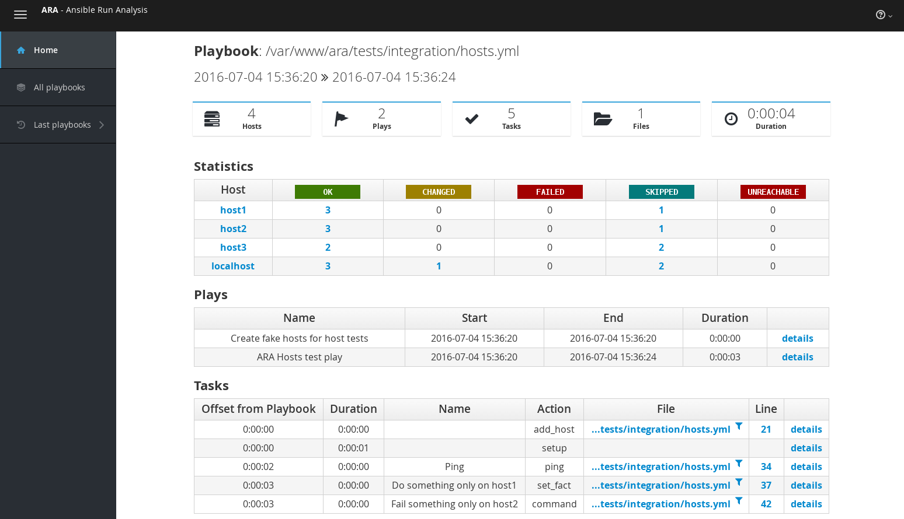
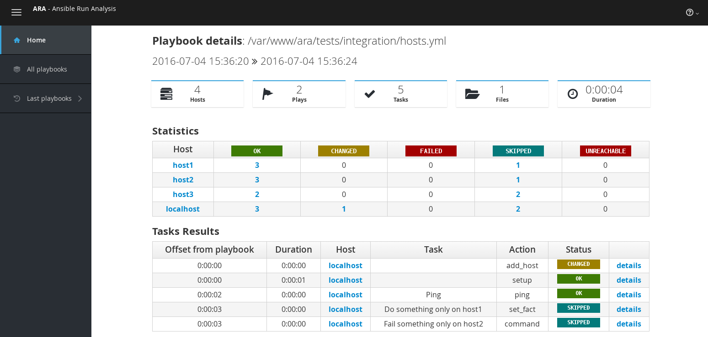

FAQ
===
What is ARA ?
-------------
ARA_ is an attempt to make Ansible_ runs easier to visualize, understand and
troubleshoot.

ARA is three things:

1. An `Ansible callback plugin`_ to record playbook runs into a local or remote database
2. A `CLI client`_ to query the database
3. A `web interface`_ to visualize the database

.. _ARA: https://github.com/dmsimard/ara
.. _Ansible: https://www.ansible.com/
.. _Ansible callback plugin: https://ara.readthedocs.io/en/latest/configuration.html#ansible
.. _CLI client: https://ara.readthedocs.io/en/latest/usage.html#querying-the-database-with-the-cli
.. _web interface: https://ara.readthedocs.io/en/latest/usage.html#browsing-the-web-interface

What does the web interface look like ?
---------------------------------------
A video is available on YouTube_ and the following are screenshots of the
web interface:

.. _YouTube: https://www.youtube.com/watch?v=K3jTqgm2YuY

Why is ARA being developed ?
----------------------------
Ansible is an awesome tool. It can be used for a lot of things.

Reading and interpreting the output of an ansible-playbook run, especially one
that is either long running, involves a lot of hosts or prints a lot of output
can be tedious.
This is especially true when you happen to be running Ansible hundreds of times
during the day, through automated means -- for example when doing continuous
integration or continuous delivery.

ARA aims to do one thing and do it well: Record Ansible runs and provide means
to visualize these records to help you be more efficient.

Why don't you use Ansible Tower ?
---------------------------------
`Ansible Tower`_ is currently a product from Ansible and has not been open
sourced (*yet*). We do not know when it will be made freely available and it's
source opened.

Ansible Tower works in a fairly centralized way where you can trigger runs from
the web interface and it will record that run in it's database so you can see
the results in it's web interface.

ARA does not aim to be able to do things like control host inventory, control
the execution of playbooks and other nice features of Tower.

When using ARA, you can store and browse your data locally and this is in fact
the default behavior. You are not required to use a central server or upload
your data elsewhere.

ARA does provide you with the means to aggregate your Ansible run data into a
single database, whether this is by aggregating sqlite databases or by using
a central database server such as MySQL.

.. _Ansible Tower: https://www.ansible.com/tower

What versions of Ansible are supported ?
----------------------------------------
ARA is currently being developed and tested against Ansible v2.0.1.0.

There were some regressions in the v2.0.2.0 release and we're currently staying
clear of that one.

Can I use ARA outside the context of OpenStack ?
------------------------------------------------
Of course, you can.

ARA is completely generic and does not require OpenStack in any way.
ARA was developed out of necessity to make troubleshoot OpenStack continuous
integration jobs faster and easier but you can use it for what you want.
