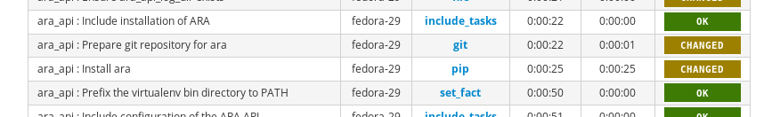

ansible-role-ara-api
====================

This Ansible role provides a framework for installing one or many instances of
`ARA Records Ansible <https://github.com/ansible-community/ara>`_ in a variety of
opinionated deployment topologies.

It is currently tested and supported against Ubuntu 18.04 and Fedora 29.

Role Variables
--------------

See `defaults/main.yaml <https://github.com/ansible-community/ara/blob/feature/1.0/roles/ara_api/defaults/main.yaml>`_.

.. literalinclude:: ../../roles/ara_api/defaults/main.yaml
   :language: yaml+jinja
   :start-after: www.gnu.org

TL;DR
-----

Playbook that runs the role with defaults:

.. code-block:: yaml+jinja

   - name: Install ARA with default settings and no persistent API server
     hosts: all
     gather_facts: yes
     roles:
       - ara_api

What the role ends up doing by default:

- Installs required packages (``git``, ``virtualenv``, etc.) if superuser privileges are available
- Stores everything in the home directory of the user in ``~/.ara``
- Retrieves ARA from source
- Installs ARA in a virtualenv
- Generates a random secret key if none are already configured or provided
- Sets up API configuration in ``~/.ara/server/settings.yaml``
- Runs the API SQL migrations (``ara-manage migrate``)

About deployment topologies
---------------------------

This Ansible role is designed to support different opinionated topologies that
can be selected with role variables.

For example, the following role variables are used to provide the topology from
the ``TL;DR`` above:

- ``ara_api_install_method: source``
- ``ara_api_wsgi_server: null``
- ``ara_api_database_engine: django.db.backends.sqlite3``
- ``ara_api_web_server: null``

The intent is that as the role gains support for other install methods,
wsgi servers, database engines or web servers, it will be possible to
mix and match according to preference or requirements.

Perhaps ARA could be installed from pypi and run with gunicorn, nginx and mysql.
Or maybe it could be installed from distribution packages and set up to run
with apache, mod_wsgi and postgresql.
Or any combination of any of those.

Example playbooks
-----------------

Install ARA and set up the API to be served by a persistent gunicorn service:

.. code-block:: yaml+jinja

   - name: Install ARA and set up the API to be served by gunicorn
     hosts: all
     gather_facts: yes
     vars:
       ara_api_wsgi_server: gunicorn
     roles:
       - ara_api

Install ARA and set up the API to be served by nginx in front of gunicorn:

.. code-block:: yaml+jinja

   # Requires superuser privileges to set up nginx and the ara-api service
   # The API will be reachable at http://api.ara.example.org
   - name: Install ARA and set up the API to be served by nginx in front of gunicorn
     hosts: all
     gather_facts: yes
     vars:
        ara_api_frontend_server: nginx
        ara_api_wsgi_server: gunicorn
        ara_api_fqdn: api.ara.example.org
        ara_api_allowed_hosts:
          - api.ara.example.org
        ara_api_frontend_vhost: custom_vhost.conf.j2
      roles:
        - ara_api

.. _include_delimiter_end:

Copyright
---------

.. code-block:: text

   Copyright (c) 2019 Red Hat, Inc.

   ARA Records Ansible is free software: you can redistribute it and/or modify
   it under the terms of the GNU General Public License as published by
   the Free Software Foundation, either version 3 of the License, or
   (at your option) any later version.

   ARA Records Ansible is distributed in the hope that it will be useful,
   but WITHOUT ANY WARRANTY; without even the implied warranty of
   MERCHANTABILITY or FITNESS FOR A PARTICULAR PURPOSE.  See the
   GNU General Public License for more details.

   You should have received a copy of the GNU General Public License
   along with ARA Records Ansible. If not, see <http://www.gnu.org/licenses/>.
