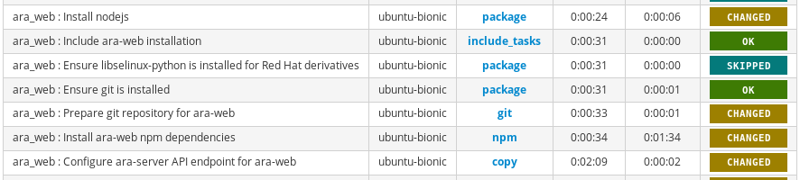

ansible-role-ara-web
====================

This Ansible role provides a framework for installing one or many instances of
`ara-web <https://github.com/ansible-community/ara-web>`_ in a variety of
opinionated deployment topologies.

It is currently tested and supported against Ubuntu 18.04 and Fedora 29.

Role Variables
--------------

See `defaults/main.yaml <https://github.com/ansible-community/ara/blob/feature/1.0/roles/ara_web/defaults/main.yaml>`_.

.. literalinclude:: ../../roles/ara_web/defaults/main.yaml
   :language: yaml+jinja
   :start-after: www.gnu.org

TL;DR
------

This is what the role does by default out of the box:

- Retrieves ara-web from source
- Installs nodejs LTS (v10)
- Installs ara-web dependencies with npm
- Configures an ara-server API endpoint in ara-web's ``public/config.json`` file
- Sets up a systemd unit file for running ara-web with the embedded development server

About deployment topologies
---------------------------

This Ansible role is designed to support different opinionated topologies that
can be selected with role variables.

For example, the following role variables are defaults used to provide the
topology from the ``TL;DR`` above:

- ``ara_web_install_method: source``
- ``ara_web_dev_server: true``
- ``ara_web_frontend_server: null``

The intent is that as the role gains support for other install methods or
frontend servers, it will be possible to mix and match according to preference
or requirements.

Example playbooks
-----------------

Deploy the ARA API and web client on the same machine with defaults:

.. code-block:: yaml+jinja

    - name: Deploy ARA API and web client
      hosts: all
      gather_facts: yes
      vars:
        # ara_api
        ara_api_fqdn: api.ara.example.org
        ara_api_wsgi_server: gunicorn
        ara_api_allowed_hosts:
        - api.ara.example.org
        ara_api_cors_origin_whitelist:
        - web.ara.example.org
        # ara_web
        ara_web_fqdn: web.ara.example.org
        ara_web_api_endpoint: "http://api.ara.example.org"
    roles:
        - ara_api
        - ara_web

Deploy only ara-web behind nginx and point it to a remote API endpoint:

.. code-block:: yaml+jinja

    # Note: Don't forget to add the web fqdn in the remote cors_origin_whitelist.
    # Otherwise, the web client might not be authorized to query the API.
    - name: Deploy ara-web for remote API endpoint
      hosts: all
      gather_facts: yes
      vars:
        ara_web_fqdn: web.ara.example.org
        ara_web_api_endpoint: "http://api.remoteara.example.org"
        ara_web_frontend_server: nginx
        ara_web_frontend_vhost: custom-web-vhost.conf.j2
    roles:
        - ara_web

.. _include_delimiter_end:

Copyright
---------

::

    Copyright (c) 2019 Red Hat, Inc.

    ARA Records Ansible is free software: you can redistribute it and/or modify
    it under the terms of the GNU General Public License as published by
    the Free Software Foundation, either version 3 of the License, or
    (at your option) any later version.

    ARA Records Ansible is distributed in the hope that it will be useful,
    but WITHOUT ANY WARRANTY; without even the implied warranty of
    MERCHANTABILITY or FITNESS FOR A PARTICULAR PURPOSE.  See the
    GNU General Public License for more details.

    You should have received a copy of the GNU General Public License
    along with ARA Records Ansible. If not, see <http://www.gnu.org/licenses/>.
